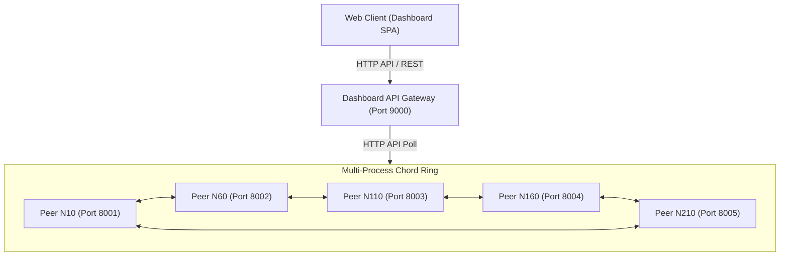

# 📚 P2P Library Search - Hệ thống Tìm kiếm Thư viện Phân tán trên DHT Chord

[](https://www.python.org/)
[](https://fastapi.tiangolo.com/)
[](https://react.dev/)
[](https://vitejs.dev/)

---

## 🏛️ MỤC I: TỔNG QUAN HỆ THỐNG & TẦM NHÌN DỰ ÁN

Trong các hệ thống chia sẻ file ngang hàng (P2P) sơ khai, bài toán tìm kiếm tài nguyên thường được giải quyết bằng cơ chế **Flooding (lụt tin)** — gửi yêu cầu đến tất cả các node xung quanh. Phương pháp này gây ra thảm họa nghẽn băng thông mạng (Broadcast Storm) khi số lượng node tăng lên.

**P2P Library Search** giải quyết triệt để vấn đề này bằng cách triển khai mô hình **DHT (Distributed Hash Table)** dựa trên thuật toán **Chord**. Dự án cung cấp một giải pháp tìm kiếm thư viện truyện số (chứa 100 tác phẩm văn học mẫu) phân tán, trong đó:
*   Không có bất kỳ máy chủ trung tâm nào quản lý chỉ mục dữ liệu.
*   Mỗi máy ngang hàng (Peer) vừa làm nhiệm vụ định tuyến tin nhắn, vừa lưu trữ một phần chỉ mục sách và nội dung sách.
*   Tốc độ tìm kiếm đạt độ tối ưu tiệm cận toán học: chỉ mất tối đa $O(\log N)$ bước nhảy (hops) để định vị bất kỳ tài liệu nào trên toàn mạng.
*   Tích hợp giao diện **Web Dashboard** thời gian thực giúp trực quan hóa cấu trúc overlay và cơ chế phục hồi lỗi.

---

## 🗺️ MỤC II: KIẾN TRÚC LÕI PHÂN TÁN (CORE ARCHITECTURE)

Hệ thống hoạt động trên một không gian định danh vòng tròn (Ring) có kích thước $2^m$ (mặc định $m=8$, tương đương $256$ tọa độ).



### 1. Cơ Chế Băm Nhất Quán (Consistent Hashing)
Consistent Hashing đảm bảo việc phân bổ dữ liệu lên các node một cách đồng đều và giảm thiểu tối đa việc phân phối lại dữ liệu khi mạng biến động (Churn):
*   **Định vị Node và Key:** Cả Node ID và Key (mã băm của từ khóa/tên sách) đều được ánh xạ lên cùng một vòng tròn ID từ $0$ đến $256$.
*   **Quy tắc kế nhiệm (Successor):** Một Key có mã băm $K$ sẽ do Node đầu tiên có $ID \ge K$ theo chiều kim đồng hồ chịu trách nhiệm quản lý.

### 2. Mô Hình Lưu Trữ 3 Lớp Tại Mỗi Peer
Để phục vụ cả tính năng tìm kiếm nhanh và khả năng chịu lỗi cao, mỗi Peer quản trị 3 kho dữ liệu riêng biệt:
1.  **`dht_store` (Inverted Index - Chỉ mục ngược phân tán):** Lưu trữ dạng `Dict[str, Set[int]]` (Ví dụ: `{"database": {1, 2, 3}}`). Đây là danh sách các từ khóa trỏ đến mã sách (`doc_id`).
2.  **`content_store` (Kho truyện gốc):** Lưu trữ nội dung chi tiết dạng JSON của truyện. Khi người dùng nhấp đọc sách, Client sẽ truy vấn trực tiếp vào kho này của Owner Node thông qua `doc_id`.
3.  **`replica_store` & `replica_content_store` (Kho dự phòng):** Sao lưu dự phòng toàn bộ dữ liệu chính của **Predecessor** (Node đứng ngay phía sau nó ngược chiều kim đồng hồ).

### 3. Định Tuyến Tốc Độ Cao Với Finger Table
Thay vì chỉ biết Successor gần nhất (độ phức tạp $O(N)$), mỗi node lưu giữ **Finger Table** gồm $m$ lối tắt (Shortcuts):
$$finger[i] = successor(n + 2^{i-1}) \pmod{2^m}$$
Cơ chế này cho phép node hiện tại gửi gói tin truy vấn nhảy vọt qua vòng tròn, thu hẹp khoảng cách tìm kiếm đi một nửa sau mỗi bước đi, đạt độ phức tạp $O(\log N)$.

---

## ⚡ MỤC III: CƠ CHẾ VẬN HÀNH & KHẢ NĂNG TỰ PHỤC HỒI (FAULT TOLERANCE)

Môi trường mạng phân tán P2P luôn đối mặt với vấn đề node ra vào liên tục hoặc đột ngột mất kết nối (Churn). Hệ thống cài đặt các thuật toán tự phục hồi khép kín cực kỳ bền bỉ:

> [!IMPORTANT]  
> **Quy trình Tự khắc phục Lỗi tự động:**
> 1.  **Heartbeat Detection (Phát hiện nhịp tim):** Các node liên tục thực hiện Ping để theo dõi tình trạng hoạt động của Predecessor và Successor.
> 2.  **Replica Promotion (Thăng cấp dữ liệu):** Khi phát hiện Predecessor đột ngột sập mạng, Node kế nhiệm lập tức thăng cấp kho dữ liệu backup `replica_store` của kẻ đã chết thành dữ liệu chính (`dht_store`) của mình để duy trì tính sẵn sàng của dữ liệu.
> 3.  **Ring Stabilization (Ổn định cấu trúc vòng):** Node tự động cập nhật lại các liên kết Predecessor/Successor bị đứt gãy để nối lại vòng tròn khép kín.
> 4.  **Re-replication (Tái sao lưu dự phòng):** Ngay sau khi cấu trúc vòng được vá và định vị được Successor mới, Node hiện tại sẽ tự động đóng gói dữ liệu chính của mình gửi sang Successor mới để thiết lập lại bản sao lưu dự phòng an toàn.

---

## 🖥️ MỤC IV: GIAO DIỆN WEB DASHBOARD & GIÁM SÁT REAL-TIME

Hệ thống tích hợp một ứng dụng Web Dashboard hoàn chỉnh (React + Vite + Tailwind/Vanilla CSS) kết nối trực tiếp với mạng lưới phân tán để cung cấp các góc nhìn trực quan:
*   **Bản đồ Overlay vòng tròn Chord:** Trực quan hóa cấu trúc vòng tròn, tọa độ và vị trí thực tế của toàn bộ các Node đang chạy trên mạng.
*   **Message Tracing (Theo dấu gói tin):** Vẽ trực quan đường đi của gói tin tìm kiếm thời gian thực, cho thấy gói tin nhảy qua những Node trung gian nào trong Finger Table trước khi đến đích.
*   **Quản lý nội dung dữ liệu:** Hiển thị chi tiết số lượng từ khóa, sách chính và sách replica đang lưu trữ trên từng máy ngang hàng cụ thể.
*   **Professor Control Panel:** Khu vực giả lập các tình huống sập node, thêm node mới động phục vụ cho việc trình diễn.

---

## 📁 MỤC V: CẤU TRÚC BỐ TRÍ DỰ ÁN & MÃ NGUỒN

Dưới đây là sơ đồ tổ chức của dự án. Xin lưu ý toàn bộ mã nguồn thực thi nằm hoàn toàn trong thư mục **`p2p_search/`**:

```text
📂 P2P-Library-Search (Thư mục gốc)
├── 📂 bao_cao_mon_hoc      # Tài liệu báo cáo, slide thuyết trình môn học
├── 📂 docs                 # Các tài liệu đặc tả thiết kế hệ thống
├── 📅 kien_thuc.md         # Tổng hợp kiến thức và cơ chế lý thuyết Chord DHT
├── 📅 p2p_library_100_stories.json # Dataset mẫu chứa 100 tác phẩm truyện
├── 📅 README.md            # [BẠN ĐANG Ở ĐÂY] Tài liệu tổng quan toàn bộ dự án
│
└── 📂 p2p_search           # 📦 THƯ MỤC CHỨA TOÀN BỘ MÃ NGUỒN
    ├── 📂 src              # Lõi thuật toán Chord và các tiện ích
    │   ├── 📂 chord        # Mixins xử lý định tuyến (routing) & lưu trữ (storage)
    │   │   ├── 📅 routing_mixin.py  # Thuật toán ổn định vòng và sửa Finger Table
    │   │   ├── 📅 storage_mixin.py  # Thuật toán lưu trữ, thăng cấp replica, re-replication
    │   │   └── 📅 ring.py           # Quản lý vòng tròn cục bộ
    │   ├── 📂 models       # Định nghĩa schemas dữ liệu truyền thông
    │   └── 📅 query_engine.py   # Xử lý truy vấn kết hợp từ khóa (Boolean AND Query)
    ├── 📂 dashboard        # Giao diện giám sát mạng P2P Web UI
    │   ├── 📂 backend      # API Server tổng hợp trạng thái (dashboard_server.py)
    │   └── 📂 frontend     # Giao diện Web hiển thị Ring (React + Vite)
    ├── 📅 peer_server.py   # Web Server FastAPI chạy độc lập cho một Node Peer đơn lẻ
    ├── 📅 demo_split.py    # Kịch bản khởi chạy mạng HTTP phân tán mở rộng (6 cửa sổ riêng biệt)
    └── 📅 pyproject.toml   # Khai báo thư viện phụ thuộc của dự án (FastAPI, NetworkX, ...)
```

---

## 🚀 MỤC VI: HƯỚNG DẪN CÀI ĐẶT & CHẠY DEMO THỰC NGHIỆM

### Yêu Cầu Hệ Thống
*   **Python:** Phiên bản 3.12 trở lên.
*   **Quản lý thư viện:** Khuyến nghị sử dụng [uv](https://github.com/astral-sh/uv) để tự động hóa thiết lập môi trường ảo siêu tốc và chính xác.

---

### 🛠️ Bước 1: Cài Đặt Dependencies
Mở Terminal tại thư mục gốc dự án và di chuyển vào thư mục code chính `p2p_search` để đồng bộ môi trường:

```bash
# Di chuyển vào thư mục mã nguồn chính
cd p2p_search

# Đồng bộ môi trường ảo và dependencies tự động bằng uv
uv sync
```

---

### 🧪 Bước 2: Khởi Chạy Mạng HTTP Phân Tán Thực Tế (Multi-Terminal Demo)
Kịch bản demo được chạy thông qua file **[demo_split.py](file:///e:/LEARN/HTPT/p2p_search/demo_split.py)**. 

Script này sẽ tự động hóa toàn bộ quy trình:
1.  Mở độc lập **5 cửa sổ CMD riêng biệt (Command Prompt)** chạy 5 Peer Server (tương ứng với các Node ID 10, 60, 110, 160, 210 trên các cổng từ `8001` đến `8005`) với cờ tự động ổn định `--auto-stabilize`.
2.  Mở thêm **1 cửa sổ CMD thứ 6** chạy máy chủ Aggregator API Dashboard phục vụ UI tĩnh trên cổng `9000`.
3.  Tự động kích hoạt trình duyệt web để truy cập Dashboard giám sát.

Cách chạy vô cùng đơn giản:
```bash
uv run demo_split.py
```

> [!TIP]  
> *   **Giao diện Web:** Hãy theo dõi Dashboard tại **[http://127.0.0.1:9000](http://127.0.0.1:9000)**. Bạn có thể tìm kiếm, đọc truyện và trực quan hóa luồng đi của gói tin băm ngay trên sơ đồ mạng Chord!
> *   **Để tắt hệ thống:** Bạn chỉ cần tắt (nút `[X]`) thủ công các cửa sổ CMD dòng lệnh màu đen vừa được mở lên để giải phóng cổng mạng.

---

## 🎓 MỤC VII: KỊCH BẢN DEMO THỰC TẾ DÀNH CHO BÁO CÁO (PROFESSOR SCENARIOS)

Để thuyết phục hội đồng báo cáo về tính đúng đắn của thuật toán Chord và khả năng tự phục hồi mạng P2P, hãy thực hiện hai kịch bản trực quan sau trên giao diện Dashboard:

### 📍 Kịch Bản 1: Gia Nhập Node Mới Động (Dynamic Join)
*   **Bước 1:** Khởi chạy độc lập một Node mới mang mã ID `135` trên cổng `8006` bằng cách mở một Terminal mới và chạy:
    ```bash
    uv run peer_server.py --node-id 135 --port 8006 --m 8 --auto-stabilize --stabilize-interval 5
    ```
*   **Bước 2:** Trên giao diện Dashboard Web, tìm đến phần **"Professor Demo: Dynamic Join"**. Nhập Node ID: `135`, Port: `:8006` và bấm **Add Peer to Dashboard**. Node 135 sẽ hiển thị độc lập trên sơ đồ mạng.
*   **Bước 3:** Nhấp nút **Join** trên thẻ Node 135, nhập ID của một Node trung gian bất kỳ đang chạy (ví dụ: `10`) để dẫn đường và bấm **OK**.
*   *Kết quả chứng minh:* Sơ đồ mạng sẽ tự động vẽ lại liên kết, chèn Node 135 vào giữa Node 110 và 160. Đồng thời các phần dữ liệu băm thuộc phạm vi quản lý mới của Node 135 sẽ tự động được chuyển giao thành công sang cho nó từ node successor.

### 📍 Kịch Bản 2: Node Sập Đột Ngột & Tự Phục Hồi Dữ Liệu (Node Failure & Fault Tolerance)
*   **Bước 1:** Xác định một Node bất kỳ đang nắm giữ nhiều dữ liệu chỉ mục và dữ liệu backup trên mạng (ví dụ Node `60` tại cổng `8002`).
*   **Bước 2:** Mô phỏng sập mạng bằng cách tắt đột ngột tiến trình của Node 60 (hoặc tắt cửa sổ CMD của Node 60).
*   **Bước 3:** Quan sát sự tự phục hồi kỳ diệu của hệ thống:
    *   Node `110` (Successor của Node 60) thông qua Heartbeat phát hiện Node 60 chết.
    *   Node 110 lập tức kích hoạt cơ chế `_promote_replicas()`, đưa toàn bộ dữ liệu backup của Node 60 lên làm dữ liệu chính của mình.
    *   Thuật toán stabilize tự động sửa vòng tròn, liên kết trực tiếp Node 10 sang Node 110.
    *   Bạn tiến hành gõ tìm kiếm sách thuộc phạm vi của Node 60 nắm giữ trước đó trên ô tìm kiếm chung. **Kết quả vẫn trả về đầy đủ 100%** và gói tin tự động định tuyến qua Node 110 để lấy dữ liệu!

---

## 🧪 MỤC VIII: KIỂM THỬ ĐẢM BẢO CHẤT LƯỢNG (UNIT TESTS)

Dự án tuân thủ nghiêm ngặt quy trình kiểm thử đơn vị để đảm bảo tính đúng đắn của cấu trúc liên kết và sự toàn vẹn của dữ liệu:
*   Được cài đặt bằng thư viện `pytest` kiểm thử các trường hợp: băm nhất quán, tìm kiếm successor, cập nhật finger table, thăng cấp replica và xử lý churn.
*   Để chạy kiểm thử đơn vị, di chuyển vào `p2p_search` và thực thi:

```bash
pytest -v
```