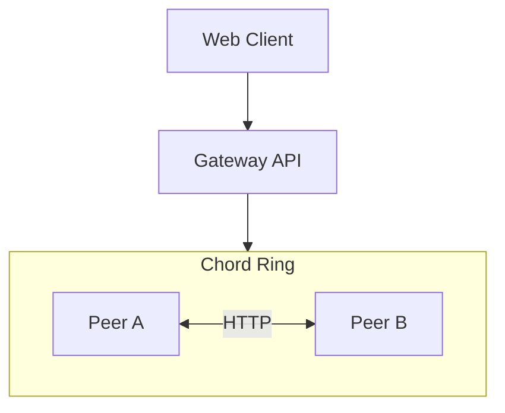
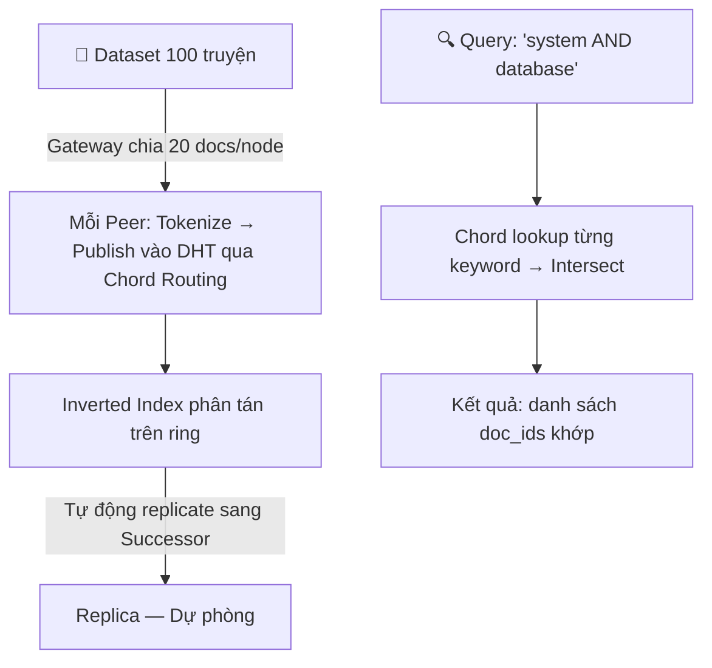

# 4. Kiến Trúc Hệ Thống (System Architecture)

---

## 4.1 Tổng Quan

| Lớp | Vai trò |
|---|---|
| **Web Client** | Giao diện người dùng — query, xem trạng thái ring, điều khiển |
| **Gateway API** | Điều phối mạng peer (register, join, stabilize, publish) và proxy query |
| **Chord Ring** | Các peer độc lập, giao tiếp qua HTTP, lưu dữ liệu in-memory |

Demo chạy **5 peer** (Node 10, 60, 110, 160, 210 trên port 8001–8005). Kiến trúc có thể scale thêm peer — tối đa 256 node với m = 8 bit.

---

## 4.2 Bên Trong Mỗi Peer

Mỗi peer sở hữu **1 instance ChordNode** và **1 lớp Transport**:

**ChordNode** lưu (in-memory):
- **Inverted Index** (`keyword → Set[doc_ids]`) — chỉ mục phân tán, phục vụ tìm kiếm.
- **Document Content** (`doc_id → nội dung truyện`) — nội dung tài liệu gốc.
- **Replica** (bản sao index + content từ predecessor) — phục vụ phục hồi khi node chết.
- **Finger Table + Successor/Predecessor** — metadata định tuyến O(log N).

**Transport** lưu (in-memory):
- **Peer Registry** (`node_id → URL`) — để biết gửi message đến địa chỉ nào.
- **Message Log** — ghi vết mọi message đã gửi, phục vụ đo lường metrics.

---

## 4.3 Luồng Dữ Liệu

