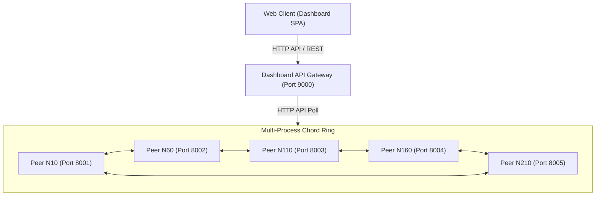
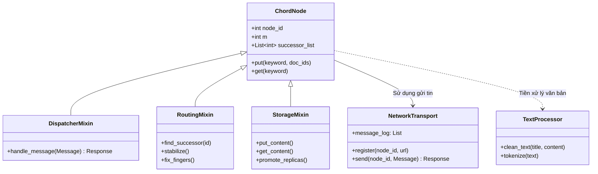
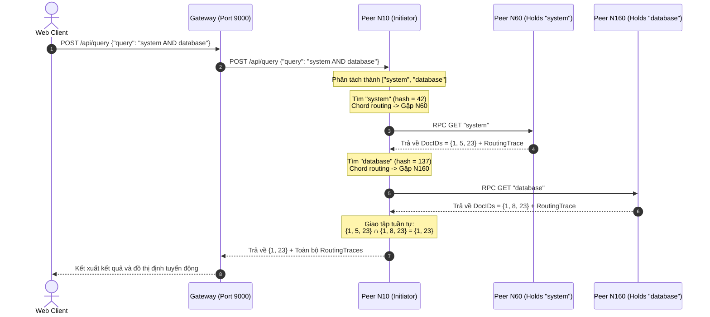
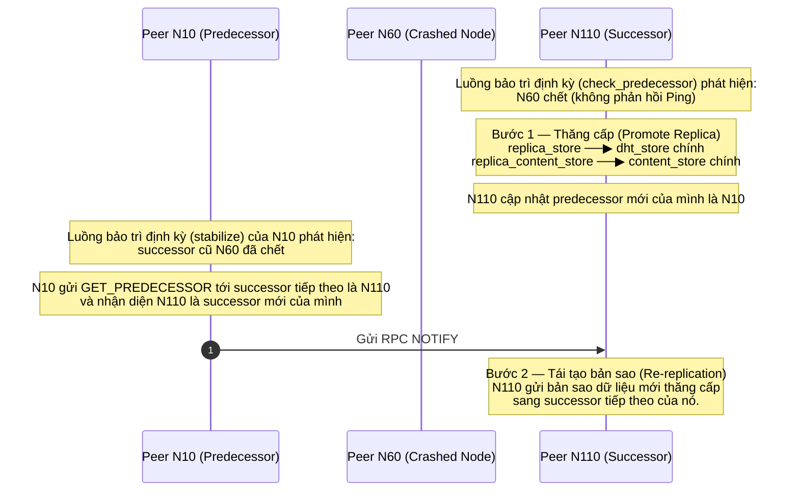

# 1. Thiết Kế Hệ Thống & Giao Thức Truyền Thông (Design System & Protocols)

---

## 1.1 Kiến Trúc Tổng Quan (System Overview)

Hệ thống **"P2P Library Search"** được xây dựng trên nền tảng mạng phân tán P2P dựa trên giao thức **Chord DHT** để giải quyết bài toán tìm kiếm sách phi trung tâm không phụ thuộc vào một Single Point of Failure (SPOF).



### Đặc trưng kỹ thuật cốt lõi:
*   **Mạng Đa Tiến Trình Thực Tế (Multi-Process WAN/LAN Simulation)**: Mỗi Peer chạy độc lập dưới dạng một tiến trình web server FastAPI (Uvicorn), lắng nghe trên một cổng HTTP riêng (cổng 8001–8005 tương ứng cho các Peer ID 10, 60, 110, 160, 210) và giao tiếp qua HTTP Client phi chặn (HTTPX với TCP Connection Pooling).
*   **Phân Mảnh Dữ Liệu Hai Tầng Độc Lập (Dual-Layer Index & Data Partitioning)**: Cả hai lớp dữ liệu đều được phân phối đồng nhất lên vòng Ring có kích thước $m=8$ (không gian địa chỉ $[0, 255]$) bằng hàm băm nhất quán:
    $$\text{key\_id} = \text{SHA-1(key)} \pmod{256}$$
    *   **Lớp 1 — Chỉ mục phân tán (Distributed Inverted Index)**: Ánh xạ từ khóa `keyword` $\rightarrow$ tập hợp mã tài liệu `Set[DocID]`.
    *   **Lớp 2 — Nội dung tài liệu (Document Content)**: Ánh xạ mã tài liệu `str(DocID)` $\rightarrow$ toàn bộ văn bản nội dung cuốn sách.

---

## 1.2 Thiết Kế Module của Peer & Mô Hình Lưu Trữ (Peer Architecture & Data Models)

### A. Sơ đồ Kiến trúc Module bên trong một Peer
Để đảm bảo nguyên tắc tách biệt trách nhiệm (Loose Coupling) và cô lập lỗi, mỗi Peer Node được thiết kế theo mô hình phân tách chức năng rõ ràng, trong đó `ChordNode` cốt lõi được cấu thành từ việc kế thừa các lớp Mixin độc lập (Mixin Composition Pattern):



### B. Thiết kế bộ nhớ trong Node (In-Memory Storage Topology)
Mỗi Peer Node duy trì 4 vùng nhớ in-memory riêng biệt để lưu trữ dữ liệu chính thức và bản sao dự phòng nhằm đạt được tính chịu lỗi (Fault Tolerance) cao:

```
┌──────────────────────────────────────────────────────────────┐
│                      PEER IN-MEMORY STORE                    │
├──────────────────────────────┬───────────────────────────────┤
│    PRIMARY STORE (Chính)     │     REPLICA STORE (Bản sao)   │
├──────────────────────────────┼───────────────────────────────┤
│ dht_store:                   │ replica_store:                │
│   "keyword" ──▶ Set[DocID]   │   "keyword" ──▶ Set[DocID]   │
├──────────────────────────────┼───────────────────────────────┤
│ content_store:               │ replica_content_store:        │
│   DocID ──▶ Full JSON Story  │   DocID ──▶ Full JSON Story   │
└──────────────────────────────┴───────────────────────────────┘
```

### C. Định dạng Thông điệp P2P (HTTP POST Payload)
Mọi giao tiếp truyền tin P2P giữa các node đều được tuần tự hóa (Serialization) dưới dạng các lớp gói tin JSON gửi qua cổng HTTP POST `/message`:
*   **Gói tin gửi đi (`Message` Dataclass)**:
    ```python
    {
        "type": str,         # Kiểu lệnh: e.g., FIND_SUCCESSOR, PUT, GET, NOTIFY, BULK_STORE_REPLICA
        "sender_id": int,    # ID của node gửi tin
        "payload": dict,     # Dữ liệu truyền tải
        "ttl": int           # Time-To-Live (mặc định = 20) chống lặp định tuyến vô hạn
    }
    ```
*   **Gói tin trả về (`Response` Dataclass)**:
    ```python
    {
        "success": bool,     # Trạng thái thành công hay thất bại
        "data": dict,        # Kết quả phản hồi (e.g. routing_trace, doc_ids)
        "error": str|None    # Mã lỗi khi có sự cố xảy ra
    }
    ```

---

## 1.3 Đặc Tả Giao Thức Giao Tiếp & APIs (Communication Protocols)

### A. Giao thức Truyền tin giữa các Peer (Peer-to-Peer Port 8001–8005)
Các node giao tiếp với nhau qua một cổng Endpoint duy nhất là **`POST /message`**. Payload của request chứa JSON đại diện cho `Message`. Các lệnh truyền tin chính được định nghĩa như sau:

| Lệnh truyền tin (`type`) | Mục tiêu Payload (`payload`) | Kết quả Phản hồi (`data` trong Response) |
|---|---|---|
| **`FIND_SUCCESSOR`** | `{"id": int}` | `{"successor_id": int, "routing_trace": dict}` |
| **`NOTIFY`** | `{"node_info": {"id": int, "url": str}}` | `{"status": "notified"}` |
| **`GET_PREDECESSOR`** | *Trống* | `{"predecessor_id": int \| None}` |
| **`PUT`** | `{"keyword": str, "doc_ids": List[int]}` | `{"status": "stored"}` |
| **`GET`** | `{"keyword": str}` | `{"doc_ids": List[int]}` |
| **`PUT_CONTENT`** | `{"doc_id": int, "content": dict}` | `{"status": "stored_content"}` |
| **`GET_CONTENT`** | `{"doc_id": int}` | `{"content": dict}` |
| **`BULK_STORE_REPLICA`**| `{"index": dict, "content": dict}` | `{"status": "replica_synced"}` |

### B. Gateway / Dashboard Aggregator APIs (Port 9000)
Dashboard Aggregator API đóng vai trò như một **Observer** (thu thập trạng thái) và một **API Gateway** trung gian:
*   **`/api/setup/join`** (POST): Thực hiện kích hoạt quy trình gia nhập mạng của 5 node một cách tuần tự (Node đầu tiên tự Bootstrap, các node tiếp theo join qua node bootstrap).
*   **`/api/setup/publish`** (POST): Nạp dữ liệu dataset gốc, chia đều mảng dữ liệu tài liệu (Round-robin) cho các Peer, kích hoạt Tokenizer rồi phát tán chỉ mục và tài liệu lên DHT.
*   **`/api/query`** (POST): Gửi truy vấn tìm kiếm (ví dụ: `{"query": "system AND database"}`) tới 1 node khởi tạo và nhận về kết quả giao tập kèm theo vết định tuyến đầy đủ.
*   **`/api/churn/remove`** (POST): Giả lập sự cố node rời mạng bằng cách gỡ node đó khỏi Peer Registry của các node còn lại để kích hoạt quy trình Stabilize tự phục hồi topo mạng.

---

## 1.4 Đặc Tả Các Luồng Tương Tác Cốt Lõi (Sequence Diagrams)

### Luồng 1: Distributed AND Query với Early Stop Optimization
Khi người dùng tìm kiếm đa từ khóa, hệ thống thực hiện truy vấn phân tán tuần tự và kiểm tra kết quả giao tập từng bước (Incremental Intersection) nhằm tối ưu băng thông (nếu tập giao rỗng, hệ thống dừng ngay lập tức):



### Luồng 2: Node Failure & Heartbeat-driven Churn Recovery
Mỗi node chạy ngầm một thread Daemon bảo trì định kỳ mỗi 5 giây. Khi successor/predecessor đột ngột rời mạng, hệ thống tự động chữa lành cấu trúc và khôi phục dữ liệu:



---

## 1.5 Phân Tích Đánh Đổi Kỹ Thuật (Architectural Trade-offs)

Quyết định thiết kế hệ thống P2P Chord Library Search mang tính chất thực nghiệm học thuật kết hợp mô phỏng thực tế chứa đựng các đánh đổi sâu sắc:

| Giải pháp kiến trúc | Ưu điểm | Nhược điểm / Đánh đổi |
|---|---|---|
| **Lưu trữ hoàn toàn in-memory** | Tốc độ đọc ghi cực kỳ nhanh, không tốn tài nguyên I/O đĩa cứng, cài đặt đơn giản không cần quản lý database vật lý. | Toàn bộ chỉ mục và tài liệu sẽ biến mất vĩnh viễn nếu mạng lưới bị tắt đột ngột (Không có tính bền vững - Persistence). |
| **Early Stop AND Query (Tuần tự)** | Tiết kiệm băng thông tối đa. Nếu một keyword bất kỳ trả về tập rỗng, hệ thống dừng ngay lập tức, không tốn thêm network round-trip. | Độ trễ (Latency) tổng thể cao hơn do truy vấn tuần tự so với việc gửi request đồng thời (Concurrent Fetching) tới nhiều node cùng lúc. |
| **Ring m=8 (256 địa chỉ)** | Trực quan hóa cực tốt cho học thuật, dễ dàng debug finger table và cấu trúc liên kết mạng, giảm bộ nhớ của metadata. | Giới hạn tối đa 256 peer node, xác suất đụng độ (hash collision) cao hơn rất nhiều so với không gian băm $m=160$ chuẩn. |
| **Hệ số bản sao Replication = 1** | Giảm thiểu băng thông duy trì đồng bộ ring mỗi khi ổn định dữ liệu và tiết kiệm tài nguyên RAM lưu trữ trên mỗi peer. | Độ an toàn dữ liệu thấp. Nếu hai node kề nhau đột ngột chết cùng lúc trước khi stabilize kịp chạy, dữ liệu sẽ bị mất hoàn toàn. |
