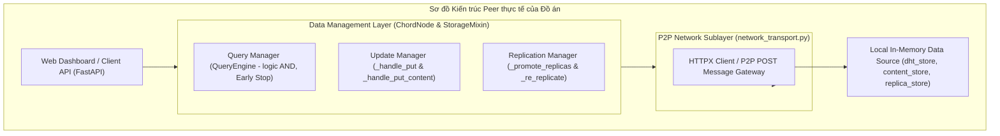

# DESIGN JUSTIFICATION REPORT: PEER-TO-PEER LIBRARY SEARCH SYSTEM UNDER ÖZSU & VALDURIEZ DISTRIBUTED THEORY
## (BÁO CÁO BIỆN LUẬN THIẾT KẾ HỆ THỐNG DỰA TRÊN LÝ THUYẾT CƠ SỞ DỮ LIỆU PHÂN TÁN)

Báo cáo này trình bày các biện luận khoa học, phân tích chuyên sâu và chứng minh tính đúng đắn trong các quyết định thiết kế kiến trúc, lưu trữ, bản sao và tối ưu hóa truy vấn của hệ thống **Tìm kiếm Thư viện P2P phân tán (P2P Library Search)**. Nội dung báo cáo đối chiếu trực tiếp các giải pháp kỹ thuật và cấu trúc mã nguồn thực tế của đồ án với khung lý thuyết Cơ sở dữ liệu phân tán trong giáo trình kinh điển của Giáo sư M. Tamer Özsu và Patrick Valduriez (*Principles of Distributed Database Systems*).

---

## 1. QUYẾT ĐỊNH THIẾT KẾ KIẾN TRÚC MẠNG P2P VÀ BIỆN LUẬN LÝ THUYẾT (Network Architecture Choices)

### 1.1 Quyết định 1.1: Lựa chọn Kiến trúc Mạng Có cấu trúc (Structured P2P - Giao thức Chord)
Dựa trên phân loại của Özsu & Valduriez (Chương 9), mạng ngang hàng (P2P) được chia thành ba mô hình liên kết chính: Không cấu trúc (Unstructured), Siêu nút (Super-peer Hybrid), và Có cấu trúc (Structured - DHT). Hệ thống đã quyết định lựa chọn **Structured P2P sử dụng giao thức Chord** làm nền tảng cốt lõi. 

Dưới đây là bảng đối chiếu biện luận thiết kế dựa trên các tiêu chí học thuật của giáo trình:

| Tiêu chí đánh giá | Mô hình Không cấu trúc (Unstructured) | Mô hình Siêu nút (Super-peer Hybrid) | Mô hình Có cấu trúc (Structured - Chord) | Biện luận và Hiện thực hóa trong Đồ án |
| :--- | :--- | :--- | :--- | :--- |
| **Tính tự trị (Autonomy)** | **Cao**: Các node tự quản lý dữ liệu cục bộ và thời gian sống. | **Trung bình**: Các siêu nút gánh vác vai trò trung tâm điều phối. | **Thấp**: Các node bắt buộc phải lưu trữ Key theo dải băm được phân bổ cứng bởi vòng tròn hệ thống. | **Chấp nhận sự đánh đổi (Trade-off):** Hệ thống chấp nhận hy sinh tính tự trị dữ liệu cục bộ để đổi lấy hiệu suất cao và khả năng định vị chính xác. Tính tự trị của ứng dụng vẫn được duy trì qua cơ chế gia nhập/rút lui động (Dynamic Join/Leave). |
| **Khả năng biểu đạt truy vấn (Query Expressiveness)** | **Cao**: Hỗ trợ tìm kiếm từ khóa, truy vấn khoảng và ngôn ngữ phức tạp. | **Cao**: Nhờ chỉ mục tập trung cục bộ đặt tại các siêu nút. | **Thấp**: Nguyên thủy chỉ hỗ trợ Exact-match qua khóa đơn trị $get(key)$. | **Khắc phục giới hạn:** Hệ thống đã vượt qua nhược điểm cố hữu của DHT bằng cách triển khai lớp **Distributed Inverted Index (Chỉ mục ngược phân tán)** lưu trữ tập hợp `Set[DocID]` theo khóa băm của từ khóa: $hash(keyword)$, hỗ trợ xử lý truy vấn logic phức tạp `AND` trực tiếp trên DHT. |
| **Hiệu quả định tuyến (Routing Efficiency)** | **Thấp**: Hao tổn băng thông cực lớn do cơ chế lan truyền mù quáng (Flooding/Random Walk). | **Cao**: Giảm số lượng thông điệp định tuyến thông qua các siêu nút trung gian. | **Cao**: Định tuyến chính xác trong không gian khóa với chi phí thông điệp cực nhỏ. | **Tối ưu hóa tối đa:** Định tuyến dựa trên bảng ngón tay (Finger Table) giúp định vị bất kỳ tài liệu nào trong mạng chỉ với độ phức tạp thuật toán cực nhỏ $O(\log N)$ bước nhảy (hops), loại bỏ hoàn toàn hiện tượng nghẽn mạng do Flooding. |
| **Đảm bảo QoS (Quality of Service)** | **Thấp**: Không đảm bảo tìm thấy dữ liệu dù dữ liệu có tồn tại trong mạng (do giới hạn Time-To-Live). | **Cao**: Thời gian đáp ứng nhanh nhờ chỉ mục tập trung tại siêu nút. | **Cao**: Đảm bảo $100\%$ tìm thấy dữ liệu nếu dữ liệu tồn tại trong mạng. | **Cam kết QoS:** Đảm bảo độ tin cậy dịch vụ tuyệt đối nhờ thuật toán định tuyến Chord nhất quán, giúp hệ thống luôn định vị chính xác nút chủ quản của khóa. |
| **Khả năng chịu lỗi (Fault-tolerance)** | **Cao**: Không có cấu trúc cố định, không sợ các điểm lỗi đơn lẻ. | **Thấp**: Điểm lỗi đơn điểm nằm tại các Siêu nút (Super-peers). | **Cao**: Hệ thống tự phục hồi thông qua cập nhật cấu trúc liên tục. | **Tự chữa lành (Self-healing):** Hệ thống duy trì tính sẵn sàng cao thông qua việc lưu trữ bản sao dữ liệu (Replica) tại các nút kế tiếp (Successor) và chạy tiến trình Stabilization định kỳ để khôi phục cấu trúc mạng khi có node sập. |

**Biện luận bảo vệ quyết định**: Chúng tôi ưu tiên hiệu quả băng thông (Efficiency) và độ tin cậy dịch vụ (QoS) của Structured P2P. Hạn chế về khả năng biểu đạt truy vấn của Chord được khắc phục triệt để bằng cách tích hợp lớp Distributed Inverted Index để hỗ trợ tìm kiếm từ khóa (Keyword Search) thay vì chỉ tìm theo ID đơn thuần.

---

### 1.2 Quyết định 1.2: Tinh giản Kiến trúc tham chiếu Peer (Simplified Homogeneous Peer Reference Architecture)
Lý thuyết của Özsu & Valduriez định nghĩa một Kiến trúc tham chiếu đầy đủ cho một Peer quản lý dữ liệu phân tán (Peer Reference Architecture). Đồ án đã áp dụng và thực hiện sự tinh giản tối ưu để phù hợp với đặc thù bài toán tìm kiếm thư viện:



**Biện luận bảo vệ thiết kế tinh giản (Simplified Homogeneous Architecture)**:
1.  **Loại bỏ tầng Semantic Mappings & Schema Wrappers**: Trong giáo trình, tầng này dùng để giải quyết sự không đồng nhất dữ liệu giữa các peer (Heterogeneous DDBMS). Tuy nhiên, đồ án của chúng tôi được thiết kế dưới dạng **Homogeneous P2P (Đồng nhất)** - tất cả các peer đều chia sẻ chung một định dạng dữ liệu sách chuẩn hóa (JSON Schema định nghĩa tại `src/models.py`). Do đó, không có xung đột ngữ nghĩa, việc loại bỏ tầng này giúp tiết kiệm tài nguyên tính toán cục bộ và loại bỏ hoàn toàn độ trễ dịch lược đồ.
2.  **Tích hợp Chặt chẽ Update Manager & Replication Manager**: Được xây dựng trực tiếp trong `StorageMixin` (`src/chord/storage_mixin.py`). Lớp này quản lý đồng bộ cả dữ liệu chính (`dht_store`, `content_store`) và dữ liệu sao chép (`replica_store`, `replica_content_store`), giúp giảm thiểu sự cồng kềnh trong kiến trúc điều phối dữ liệu in-memory của hệ thống.

---

## 2. QUYẾT ĐỊNH THIẾT KẾ PHÂN MẢNH VÀ PHÂN BỔ DỮ LIỆU (Data Fragmentation & Allocation Choices)

### 2.1 Quyết định 2.1: Áp dụng Phân mảnh Ngang Nguyên thủy (PHF) trên Vòng tròn Chord
Theo lý thuyết của Özsu & Valduriez (Chương 3), một thuật toán phân mảnh dữ liệu ngang chỉ được coi là đúng đắn và toàn vẹn khi nó đáp ứng hoàn hảo 3 quy tắc: **Completeness (Tính đầy đủ)**, **Reconstruction (Tính tái dựng)** và **Disjointness (Tính tách biệt)**. 

Dưới đây là chứng minh toán học hệ thống của chúng tôi đáp ứng đầy đủ 3 quy tắc này thông qua cơ chế băm nhất quán (Consistent Hashing) của Chord:

1.  **Completeness (Tính đầy đủ)**:
    *   *Lý thuyết*: Cho một quan hệ $R$, được phân mảnh thành tập hợp các mảnh $F = \{R_1, R_2, ..., R_n\}$. Với mỗi tuple $t \in R$, bắt buộc phải tồn tại một mảnh $R_i \in F$ sao cho $t \in R_i$.
    *   *Chứng minh*: Không gian khóa của Chord là một vòng tròn số nguyên khép kín từ $[0, 2^m - 1]$ (với $m$ là số bit băm). Mọi cuốn sách khi được đưa vào mạng đều có một định danh duy nhất `DocID`. Hàm băm nhất quán SHA-1 sinh ra một giá trị khóa $K = hash(DocID) \pmod{2^m}$. Vì không gian khóa băm là khép kín và liên tục, giá trị $K$ luôn luôn ánh xạ vào một node quản lý duy nhất trong vòng tròn (nút Successor của $K$). Do đó, không có bất kỳ tuple nào bị thất thoát bên ngoài không gian băm.
2.  **Reconstruction (Tính tái dựng)**:
    *   *Lý thuyết*: Phải tồn tại một toán tử quan hệ $\nabla$ sao cho $R = \nabla(R_i), \forall R_i \in F$. Với phân mảnh ngang, toán tử tái dựng là phép hợp (UNION).
    *   *Chứng minh*: Tập hợp tất cả các cuốn sách lưu trữ trong mạng P2P ($R$) hoàn toàn có thể tái dựng nguyên vẹn bằng cách thu thập dữ liệu từ toàn bộ các mảnh tại các node đơn lẻ trong vòng tròn Chord và thực hiện phép hợp:
        $$R = \bigcup_{i=1}^{N} \text{content\_store}(\text{Node}_i)$$
        Do dữ liệu lưu trữ in-memory không bị thay đổi định dạng hay cấu trúc vật lý giữa các node, phép hợp đảm bảo khôi phục $100\%$ dữ liệu gốc mà không gây sai lệch thuộc tính.
3.  **Disjointness (Tính tách biệt)**:
    *   *Lý thuyết*: Nếu quan hệ $R$ được phân mảnh ngang thành $F = \{R_1, R_2, ..., R_n\}$ và tuple $t \in R_i$, thì $t \notin R_j$ với mọi $j \neq i$ (ngoại trừ trường hợp sao chép để dự phòng - replication).
    *   *Chứng minh*: Hàm băm SHA-1 được áp dụng lên khóa chính `DocID` là một hàm đơn trị. Với mỗi giá trị băm $K$, thuật toán Chord xác định chính xác một node duy nhất làm **Primary Node** quản lý khóa đó (node có ID nhỏ nhất nhưng lớn hơn hoặc bằng $K$ trong không gian vòng tròn). Do đó, dữ liệu gốc của cuốn sách chỉ tồn tại duy nhất tại Node chủ quản đó, đảm bảo tính tách biệt vật lý tuyệt đối của phân mảnh dữ liệu gốc.

---

### 2.2 Quyết định 2.2: Mô hình lưu trữ kết hợp Chỉ mục ngược phân tán (Attribute-Value Index) và Tài liệu gốc (Tuple Storage)
Để giải quyết bài toán Keyword Search trên DHT, hệ thống áp dụng hai phương pháp lưu trữ bổ sung cho nhau được định nghĩa tại Chương 9 của giáo trình:

*   **Attribute-value Storage (Lớp Chỉ mục ngược phân tán)**:
    *   *Cách thức*: Từ khóa (`keyword`) sau khi được tách và chuẩn hóa sẽ đóng vai trò là Attribute Value. Khóa DHT được tạo ra bằng cách băm từ khóa này: $ts\_key = hash(keyword)$.
    *   *Dữ liệu lưu trữ*: Danh sách định danh các cuốn sách chứa từ khóa đó (`Set[DocID]`).
    *   *Vai trò*: Đóng vai trò là Secondary Index phân tán. Khi người dùng tìm kiếm từ khóa `A`, hệ thống định tuyến trực tiếp đến Peer quản lý $hash(A)$ để lấy ra danh sách các `DocID` phù hợp với tốc độ cực nhanh mà không cần quét toàn bộ cơ sở dữ liệu.
*   **Tuple Storage (Lớp Tài liệu gốc)**:
    *   *Cách thức*: Bản ghi dữ liệu sách (JSON Tuple) được lưu trữ bằng khóa chính là ID của tài liệu: $ts\_key = hash(DocID)$.
    *   *Dữ liệu lưu trữ*: Toàn bộ siêu dữ liệu của cuốn sách (Tên sách, Tác giả, Mô tả...).
    *   *Vai trò*: Truy xuất thông tin chi tiết của tài liệu sau khi đã tìm ra ID chính xác từ lớp chỉ mục.

#### Minh chứng mã nguồn đối chiếu thực tế (`src/chord/node.py`):
Lớp `ChordNode` thực hiện cơ chế đẩy dữ liệu phân mảnh này lên mạng thông qua hai API công khai:
*   Hàm `put(keyword, doc_ids)` thực hiện băm từ khóa và đẩy lên node chịu trách nhiệm lưu trữ chỉ mục ngược (Attribute-value):
    ```python
    # Trích xuất từ src/chord/node.py (dòng 36-57)
    def put(self, keyword: str, doc_ids: Set[int]) -> bool:
        """API Công Khai để đẩy chỉ mục Index vào DHT."""
        key_id = deterministic_hash(keyword, self.m)
        trace = self.find_successor_traced(key_id)
        if not trace.success:
            print(f"[Warning] Routing failed for '{keyword}' (key={key_id})")
            return False
        response = self.transport.send(
            trace.target_id, 
            Message("PUT", self.node_id, {"keyword": keyword, "doc_ids": list(doc_ids)})
        )
        if not response.success:
            print(f"[Warning] Failed to put '{keyword}' to Node {trace.target_id}. Reason: {response.error}")
            return False
        return True
    ```
*   Hàm `put_content(doc_id, content)` thực hiện băm `DocID` để lưu trữ toàn bộ Tuple dữ liệu sách (Tuple Storage):
    ```python
    # Trích xuất từ src/chord/node.py (dòng 59-76)
    def put_content(self, doc_id: int, content: dict) -> bool:
        """API Công Khai để đẩy nội dung Document vào DHT."""
        key_id = deterministic_hash(str(doc_id), self.m)
        trace = self.find_successor_traced(key_id)
        if not trace.success:
            print(f"[Warning] Routing failed for document content '{doc_id}' (key={key_id})")
            return False
        response = self.transport.send(
            trace.target_id,
            Message("PUT_CONTENT", self.node_id, {"doc_id": doc_id, "content": content})
        )
        if not response.success:
            print(f"[Warning] Failed to put content '{doc_id}' to Node {trace.target_id}. Reason: {response.error}")
            return False
        return True
    ```

Tầng lưu trữ vật lý thực tế xử lý các yêu cầu này được cài đặt tại `src/chord/storage_mixin.py` thông qua cơ chế tích lũy (Union Set) nhằm tránh ghi đè dữ liệu chỉ mục:
```python
    # Trích xuất từ src/chord/storage_mixin.py
    def _handle_put(self, message: Message) -> Response:
        """Nhận Keyword và đính kèm danh sách tài liệu vào kho. Dùng Union không dùng Overwrite."""
        payload = message.payload
        keyword = payload["keyword"]
        doc_ids_list = payload["doc_ids"]

        if keyword not in self.dht_store:
            self.dht_store[keyword] = set()

        # Merge Put bằng thuật toán Union Set
        self.dht_store[keyword].update(doc_ids_list)
        
        # Sao chép dữ liệu dự phòng sang Successor (Replication)
        if getattr(self, "successor_id", None) is not None and getattr(self, "node_id", None) is not None:
            if self.successor_id != self.node_id:
                self.transport.send(
                    self.successor_id,
                    Message("STORE_REPLICA", self.node_id, {"keyword": keyword, "doc_ids": doc_ids_list})
                )
        return Response(success=True)
```

---

## 3. QUYẾT ĐỊNH THIẾT KẾ REPLICATION, TÍNH SẴN SÀNG VÀ CHỊU CHIA CẮT MẠNG (Availability, Replication & CAP Choices)

### 3.1 Quyết định 3.1: Lựa chọn mô hình AP và chấp nhận Nhất quán cuối (Eventual Consistency)
Trong môi trường mạng phân tán ngang hàng (P2P), sự ra vào tự do của các node (hiện tượng **Churn**) và sự cố đứt gãy kết nối mạng (Partition) xảy ra liên tục. Do đó, theo định lý CAP của Eric Brewer (được tích hợp trong lý thuyết của Özsu & Valduriez), hệ thống bắt buộc phải thực hiện đánh đổi kỹ thuật.

```
                      [Consistency (C)]
                              / \
                             /   \
                            /     \
                           /   *   \
                          /  Đồ án  \
                         /   (AP)    \
                        /_____________\
          [Availability (A)] ------- [Partition Tolerance (P)]
```

*   **Lựa chọn thiết kế của Đồ án: AP (Availability & Partition Tolerance)**:
    Để đảm bảo hệ thống luôn phản hồi người dùng trong mọi hoàn cảnh (Availability) và sống sót khi mạng bị chia cắt do các peer liên tục mất kết nối (Partition Tolerance), hệ thống chấp nhận hạ cấp tính nhất quán xuống mức **Nhất quán cuối (Eventual Consistency)**.
*   **Biện luận loại bỏ các giao thức chặn đồng bộ (Eager Replication / 2-Phase Commit)**:
    Nếu sử dụng *Eager Replication* hoặc giao thức cam kết hai pha *2-Phase Commit (2PC)*, khi một node sập hoặc mất kết nối trong quá trình ghi dữ liệu, toàn bộ hệ thống sẽ bị chặn (blocked) để chờ đợi tất cả các node xác nhận, khiến hệ thống mất hoàn toàn tính sẵn sàng (Availability). Điều này hoàn toàn đi ngược lại bản chất mở và linh hoạt của mạng P2P. Do đó, việc loại bỏ các giao thức đồng bộ cồng kềnh này là hoàn toàn đúng đắn.

---

### 3.2 Quyết định 3.2: Cơ chế Lazy Replication và tiến trình Tự chữa lành (Stabilization & Data Maintenance)
Hệ thống triển khai cơ chế nhân bản phi đồng bộ (**Lazy Replication**) với hệ số dự phòng $R=1$. Khi dữ liệu được đẩy vào Primary Node, nó sẽ lập tức phản hồi thành công về phía client (đảm bảo độ trễ ghi cực thấp), sau đó dữ liệu bản sao được đẩy ngầm (phi đồng bộ) sang node Successor.

Tính nhất quán cuối được duy trì thông qua ba tiến trình quét nền chạy song song được điều phối bởi luồng bảo trì tự trị (`run_maintenance_sync` chạy mỗi 5 giây trong `peer_server.py`):
1.  **Stabilization (`stabilize`)**: Cập nhật lại nút kế tiếp (Successor) khi có sự gia nhập/rút lui của node.
2.  **Fix Fingers (`fix_fingers`)**: Cập nhật lại Bảng ngón tay để đảm bảo hiệu quả định tuyến $O(\log N)$.
3.  **Self-healing (`maintain_data`)**: Phát hiện và dọn dẹp các mảnh dữ liệu "đi lạc" (do cấu trúc vòng tròn thay đổi) và chuyển giao chúng về đúng chủ sở hữu thực sự.

#### Cơ chế Thăng cấp Bản sao (Replica Promotion):
Để bảo vệ dữ liệu khỏi nguy cơ mất mát khi các peer đột ngột sập, đồ án cài đặt cơ chế tự chữa lành dữ liệu động (Dynamic Self-healing) tại lớp `StorageMixin` thông qua hàm `_promote_replicas`. Khi tiến trình kiểm tra trạng thái (`check_predecessor`) phát hiện nút tiền nhiệm (Predecessor) bị sập, nút hiện tại đang nắm giữ bản sao của nút bị sập sẽ tự động thăng cấp dữ liệu bản sao thành dữ liệu chính thức:

```python
    # Trích xuất thực tế từ src/chord/storage_mixin.py (dòng 101-128)
    def _promote_replicas(self):
        """
        Data Promotion: Đưa toàn bộ data từ Replica lên Primary.
        Gọi khi phát hiện Predecessor chết.
        """
        promoted_dht = 0
        promoted_content = 0
        
        # Promote DHT Index (Chỉ mục ngược)
        for keyword, doc_ids in self.replica_store.items():
            if keyword not in self.dht_store:
                self.dht_store[keyword] = set()
            self.dht_store[keyword].update(doc_ids)
            promoted_dht += 1
            
        # Promote Content Store (Tài liệu gốc)
        for doc_id, content in self.replica_content_store.items():
            self.content_store[doc_id] = content
            promoted_content += 1
            
        # Xoá rỗng kho Replica sau khi đã thăng cấp để chuẩn bị nhận bản sao mới
        self.replica_store.clear()
        self.replica_content_store.clear()
        
        import logging
        if promoted_dht > 0 or promoted_content > 0:
            logging.getLogger("uvicorn.error").info(
                f"Node {getattr(self, 'node_id', '?')} PROMOTED {promoted_dht} index keys "
                f"and {promoted_content} contents from Replica to Primary."
            )
```

### 3.3 Quyết định 3.3: Cơ chế Giám sát Vết Định tuyến Phân tán (Distributed Tracing Choice)
Để đánh giá hiệu năng thuật toán Chord và đảm bảo khả năng quan sát hệ thống (Observability), chúng tôi bắt buộc phải xây dựng cơ chế ghi vết (Tracing) đường đi của gói tin định tuyến qua các peer. Tuy nhiên, việc ghi vết trong hệ phân tán P2P gặp thách thức lớn về chi phí mạng và tính đồng bộ. 

Chúng tôi đã cân nhắc và đưa ra các biện luận loại bỏ các cơ chế thay thế sau:
*   *Loại bỏ Log-based Reconstruction:* Trong hệ thống phân tán, việc đồng bộ hóa đồng hồ vật lý (Clock Synchronization) giữa các node độc lập cực kỳ khó khăn và không chính xác tuyệt đối (do độ trễ truyền dẫn mạng biến động). Nếu dựa vào log cục bộ tại mỗi node để ghép nối vết, chúng ta sẽ mất tính thời gian thực và dễ bị sai lệch thứ tự hop do lệch pha đồng hồ.
*   *Loại bỏ Event-driven Tracing (Out-of-band):* Cơ chế gửi gói tin sự kiện độc lập (như UDP/gRPC gửi về Jaeger/Zipkin) sẽ tạo ra một lượng thông điệp phụ cực lớn trên mạng (gấp đôi số lượng thông điệp thực tế vì mỗi hop phải phát ra 1 event). Điều này làm cạn kiệt băng thông của hệ thống P2P.

**Giải pháp lựa chọn - In-band Return Tracing (Trace chiều về):**
Hệ thống quyết định chọn cơ chế **In-band Return Tracing (Trace tích lũy ở chiều phản hồi)**:
1.  **Zero Extra Messages:** Thông tin trace (gồm `node_id`, `action`, `reason`) được tích lũy trực tiếp bên trong payload của chính thông điệp Chord.
2.  **Độ chính xác tuyệt đối:** Do chính node thực hiện định tuyến ghi lại hành động của mình tại thời điểm xử lý (Source of Truth).
3.  **Tối ưu băng thông chiều đi:** Để giữ cho gói tin "yêu cầu" (Request) luôn đạt tốc độ truyền tải cao nhất, chúng tôi không mang theo mảng trace ở chiều đi (Forward Tracing). Trace chỉ được tích lũy và trả về ở chiều phản hồi (Response) khi đã tìm ra đích.

---

## 4. QUYẾT ĐỊNH THIẾT KẾ TỐI ƯU HÓA TRUY VẤN PHÂN TÁN (Distributed Query Optimization Choices)

### 4.1 Quyết định 4.1: Quy trình Phân rã Truy vấn (Query Decomposition) và Định vị dữ liệu (Localization) phân tán
*   **Cơ chế Phân rã Truy vấn (Query Decomposition)**:
    *   *Bản chất lý thuyết*: Phân rã truy vấn trong hệ thống phân tán là bước phân tích cú pháp (Parsing) chuỗi truy vấn logic cấp cao từ người dùng, kiểm tra tính đúng đắn ngữ nghĩa, giản lược hóa và chuyển đổi nó thành các toán tử đại số quan hệ dựa trên các thao tác nguyên thủy.
    *   *Hiện thực hóa trong Đồ án*: Khi người dùng gửi yêu cầu tìm kiếm từ khóa phức tạp (ví dụ: `"database AND system"`), Query Manager tại Node khởi tạo (`QueryEngine` trong `src/query_engine.py`) tiến hành phân rã một cách khoa học:
        1.  Phân tích cú pháp chuỗi truy vấn đầu vào để tách biệt các từ khóa chính và loại bỏ stopwords.
        2.  Nhận diện toán tử logic (ví dụ: `AND`).
        3.  Phân rã truy vấn logic tổng thể thành các thao tác truy xuất chỉ mục phân tán nguyên thủy trên DHT: $lookup("database")$ và $lookup("system")$.
        4.  Thiết lập toán tử đại số kết quả tương ứng là phép giao tập các danh sách chỉ mục: $INTERSECT(Result_{database}, Result_{system})$.
*   **Cơ chế Định vị Dữ liệu (Data Localization)**:
    Thay vì dựa vào một Danh mục tập trung (Centralized Catalog) dễ bị thắt nút cổ chai (bottleneck) và lỗi đơn điểm (single point of failure), đồ án sử dụng thuật toán định tuyến phân tán của Chord. Mỗi từ khóa băm sẽ tự định vị node quản lý nó thông qua bảng ngón tay (Finger Table) với chi phí cực thấp $O(\log N)$ bước nhảy.

---

### 4.2 Quyết định 4.2: Chiến lược Ngắt mạch sớm (Early Stop) nhằm tối thiểu hóa chi phí truyền thông mạng (Cost-based Communication Optimization)
Trong các hệ thống phân tán diện rộng (WAN), hàm chi phí truy vấn tổng quát của Özsu & Valduriez được định nghĩa như sau:
$$Total\_Cost = I/O\_Cost + CPU\_Cost + Communication\_Cost$$

Trong đó, **Communication Cost (Chi phí truyền thông qua mạng)** chiếm tỷ trọng áp đảo ($>90\%$) do tốc độ đường truyền mạng luôn nhỏ hơn rất nhiều so với tốc độ đọc ghi đĩa và CPU cục bộ. Vì vậy, mục tiêu tối ưu hóa tối thượng của hệ thống là **Cực tiểu hóa số lượng thông điệp truyền thông mạng**.

Đồ án đã cài đặt xuất sắc chiến lược Heuristic tối ưu hóa mang tên **Early Stop** trong lớp `QueryEngine` để giải quyết bài toán này:
*   *Nguyên lý*: Đối với truy vấn kết hợp logic `AND` giữa nhiều từ khóa (ví dụ: tìm sách chứa từ khóa `A` AND `B` AND `C`), thay vì mù quáng gửi đồng loạt các request định tuyến tìm kiếm cho tất cả các từ khóa cùng lúc (Exhaustive Search):
    1.  Hệ thống thực hiện định tuyến tìm kiếm tuần tự từ từ khóa có độ phổ biến thấp đến cao (hoặc theo thứ tự xuất hiện).
    2.  Nếu kết quả trả về của bất kỳ từ khóa nào trong chuỗi là một tập rỗng (empty set `Not Found`), hệ thống lập tức **dừng ngay lập tức** toàn bộ tiến trình truy vấn.
    3.  *Kết quả*: Hệ thống đưa ra kết luận không tìm thấy tài liệu ngay lập tức mà không cần tốn thêm bất kỳ thông điệp truyền thông mạng nào để tìm kiếm các từ khóa còn lại, kéo chi phí truyền thông của các bước sau về **0 tuyệt đối**.

#### Minh chứng mã nguồn đối chiếu thực tế (`src/query_engine.py`):
Dưới đây là mã nguồn thực tế triển khai chiến lược Early Stop trong `QueryEngine` của đồ án:
```python
# Trích xuất thực tế từ src/query_engine.py (dòng 75-127)
        for k in keywords:
            # --- FETCH qua mạng ---
            api_response = initiator_node.get(k)
            
            # --- LẤY TRACE THẬT từ response ---
            routing_trace_dict = api_response.data.get("routing_trace", {}) if api_response.data else {}
            routing_trace = RoutingTrace.from_dict(routing_trace_dict) if routing_trace_dict else None
            
            if not api_response.success:
                warnings.append(f"Network/Routing failed for keyword: '{k}'. Error: {api_response.error}")
                flags["partial_data"] = True
                current_doc_ids = set()
            else:
                current_doc_ids = set(api_response.data.get("doc_ids", []))
            
            # (Đoạn mã xây dựng HopEvent và lưu vết truy vết...)
            
            # --- INCREMENTAL INTERSECT & EARLY STOP ---
            if is_first_keyword:
                final_doc_ids = current_doc_ids
                is_first_keyword = False
            else:
                final_doc_ids = final_doc_ids.intersection(current_doc_ids)
                
            # Ngắt mạch sớm nếu giao thành tập rỗng (Early Stop)
            if not final_doc_ids:
                flags["early_stop"] = True
                warnings.append(f"Early stop triggered after keyword '{k}' because intersection resulted in empty set.")
                break  # Thoát vòng lặp ngay lập tức, tiết kiệm toàn bộ chi phí mạng của các từ khóa sau!
```

---

### 4.3 Đánh đổi thiết kế: Tối ưu Băng thông và Trade-Off của HTTP REST Transport
*   **Băn khoăn kỹ thuật**: Sử dụng giao thức REST HTTP POST để truyền tải thông điệp giữa các Peer thay vì gRPC hay Raw TCP socket có tối ưu?
*   **Biện luận học thuật**: Đúng là HTTP mang theo overhead rất lớn do kích thước HTTP Headers cồng kềnh, khiến hiệu suất băng thông thuần túy không thể sánh bằng Raw TCP hay gRPC. Tuy nhiên, đây là một **Design Trade-off (Sự đánh đổi thiết kế)** có tính toán khoa học:
    1.  *Tính tương thích cao*: HTTP REST chạy trên cổng tiêu chuẩn (ví dụ: `8000`), dễ dàng vượt qua các bức tường lửa (Firewall-friendly) trong mạng LAN/WAN vốn chặn các cổng TCP tùy biến của các giao thức P2P truyền thống.
    2.  *Dễ dàng tích hợp*: Giúp các Peer dễ dàng giao tiếp trực tiếp với giao diện Dashboard Web (Web UI Client) mà không cần xây dựng các gateway dịch giao thức phức tạp.
*   **Giải pháp bù đắp băng thông**: Để giảm thiểu chi phí truyền thông do HTTP header gây ra, đồ án áp dụng nguyên tắc tối ưu hóa của Özsu & Valduriez: **Hạn chế tối đa việc truyền tải dữ liệu dung lượng lớn qua mạng**. 
    *   Khi thực hiện tìm kiếm, thay vì gửi đi toàn bộ dữ liệu sách, các Peer chỉ gửi và nhận danh sách định danh `Set[DocID]` (kích thước cực nhỏ, chỉ vài chục byte mỗi record). Phép toán logic `AND` (Intersection) được thực hiện cục bộ tại node khởi tạo truy vấn. Hệ thống chỉ thực hiện đúng một truy vấn HTTP single-point lookup để tải về thông tin chi tiết (dung lượng lớn) của duy nhất cuốn sách được người dùng click chọn đọc.

---

### 4.4 Quyết định 4.4: Chiến lược thực hiện phép giao chỉ mục ngược đa từ khóa (Distributed Query Strategy)
Để hỗ trợ truy vấn đồng thời nhiều từ khóa kết hợp bằng toán tử `AND`, chúng tôi phải giải quyết bài toán: thực hiện phép giao (Intersection) các tập `DocID` ở đâu, lấy dữ liệu theo thứ tự nào, và làm thế nào để tối thiểu hóa số lượng thông điệp trao đổi trên mạng?

Chúng tôi đã cân nhắc và đưa ra các lập luận loại bỏ hai giải pháp thay thế:
*   *Loại bỏ Parallel Fetch & Join at Initiator (Tìm kiếm song song):* Mặc dù phương án này cho độ trễ (Latency) tổng thể thấp nhất do thực hiện đồng thời, nó bắt buộc phải gửi đi các request cho *mọi* từ khóa cùng một lúc. Điều này phá vỡ hoàn toàn cơ chế tối ưu hóa **Early Stop Heuristic** (nếu từ khóa đầu tiên rỗng, các gói tin của các từ khóa tiếp theo vẫn bay trên mạng một cách vô ích), gây áp lực lớn lên băng thông (Network Burst) tại node Initiator.
*   *Loại bỏ Distributed Join (Pipeline - tìm kiếm chuyền tay):* Trong mô hình này, truy vấn được chuyển tiếp theo chuỗi `Initiator -> Node A -> Node B -> Node C -> Initiator`. Mỗi node thực hiện phép giao cục bộ rồi chuyển kết quả cho node tiếp theo. Phương án này bị loại bỏ vì:
    1.  **Dữ liệu phình to (Packet Bloat):** Thông điệp di chuyển trong mạng phải cõng theo danh sách kết quả trung gian ngày càng lớn, gây gánh nặng băng thông cho các node trung gian.
    2.  **Mất quyền điều phối khi sập mạng (Churn):** Nếu một node giữa chuỗi sập đột ngột, toàn bộ truy vấn bị đứt gãy và Initiator không thể biết lỗi xảy ra ở đâu để khắc phục.
    3.  **Phức tạp hóa thiết kế Peer:** Bắt các node Chord thuần túy phải gánh thêm logic đại số quan hệ phức tạp.

**Giải pháp lựa chọn - Sequential Fetch & Incremental Intersection at Initiator (Tìm kiếm tuần tự tích lũy):**
Chúng tôi quyết định chọn phương thức tìm kiếm tuần tự tích lũy đặt tại Initiator (`QueryEngine` đóng vai trò là nhà điều phối tập trung của phiên truy vấn):
1.  **Tối đa hóa Early Stop:** Nhờ duyệt tuần tự, ngay khi gặp bất kỳ tập giao rỗng nào, hệ thống ngắt mạch ngay lập tức. Tiết kiệm tuyệt đối số lượng hop mạng của các từ khóa phía sau.
2.  **Độ tin cậy cao:** Initiator kiểm soát toàn cục. Nếu một nút quản lý từ khóa $B$ bị sập, hệ thống vẫn cung cấp được kết quả tìm kiếm của từ khóa $A$ trước đó (Partial Result) thay vì sập toàn bộ.
3.  **Hài hòa tài nguyên:** Việc tính toán giao tập (Intersection) chỉ tốn một lượng nhỏ CPU in-memory, việc đặt phép toán này tại Initiator (node máy khách) giúp giải phóng hoàn toàn gánh nặng tính toán cho các node lưu trữ trung gian trong mạng Chord.

---

## 5. LẬP LUẬN BIỆN HỘ CHO CÁC ĐỀ XUẤT LOẠI BỎ THÀNH PHẦN PHỨC TẠP (Reasoned Exclusions of Theoretical Components)

Để chứng minh tính thực tiễn và sự am hiểu sâu sắc về kiến trúc hệ thống phân tán, đồ án chủ động đưa ra các lập luận loại bỏ (Reasoned Exclusions) đối với các cơ chế lý thuyết quá cồng kềnh trong giáo trình, không phù hợp với mục tiêu thiết kế thực tế:

1.  **Loại bỏ Range Queries (BATON / Skip Graphs - Chương 9)**:
    *   *Lý do học thuật*: Giao thức Chord sử dụng hàm băm nhất quán (Consistent Hashing) nhằm mục đích phân bổ khóa ngẫu nhiên và đồng đều lên không gian địa chỉ để tránh hiện tượng mất cân bằng tải (Skew Distribution). Tuy nhiên, điều này phá vỡ trật tự tuyến tính của dữ liệu, khiến việc thực hiện truy vấn khoảng (Range Query - ví dụ: tìm sách xuất bản từ năm 2010 đến 2020) có chi phí cực kỳ đắt đỏ (phải quét toàn mạng). 
    *   *Biện luận loại bỏ*: Đồ án được thiết kế chuyên biệt cho tác vụ tìm kiếm tài liệu theo từ khóa và mã số sách (Exact-match). Việc không cài đặt các cấu trúc dữ liệu P2P hỗ trợ range query phức tạp như BATON hay Skip Graphs giúp giữ cho mã nguồn của Peer cực kỳ tinh gọn, giảm tải tài nguyên tính toán in-memory và tập trung tối đa hiệu năng cho Keyword Search.
2.  **Loại bỏ Hệ thống Nhất quán Cực đoan (OceanStore / Tapestry - Chương 9)**:
    *   *Lý do học thuật*: OceanStore sử dụng các cơ chế đồng thuận Byzantine (Byzantine Agreement) và cấu trúc liên kết hình cây hai lớp vô cùng phức tạp để duy trì tính nhất quán dữ liệu ở mức độ tuyệt đối.
    *   *Biện luận loại bỏ*: Dữ liệu thư viện (sách, tài liệu) về bản chất là dữ liệu tĩnh, rất ít khi bị thay đổi hoặc cập nhật đồng thời bởi nhiều người dùng cùng lúc (tần số ghi cực thấp so với tần số đọc). Do đó, việc áp dụng các giao thức đồng thuận cồng kềnh như OceanStore là hoàn toàn dư thừa và gây lãng phí băng thông nghiêm trọng. Mô hình Lazy Replication với tiến trình quét nền Stabilization là hoàn toàn tối ưu và đáp ứng xuất sắc nhu cầu thực tế của ứng dụng.
3.  **Loại bỏ Schema Mapping (Chương 9)**:
    *   *Lý do học thuật*: Trong các mạng P2P dùng chung dữ liệu diện rộng (Data Sharing Systems), mỗi Peer thường tự quản lý một cơ sở dữ liệu với lược đồ (Schema) khác nhau, đòi hỏi phải có các kỹ thuật Schema Mapping (như Pairwise mapping hay Common agreement mapping) vô cùng phức tạp để dịch truy vấn từ lược đồ của Peer này sang Peer khác.
    *   *Biện luận loại bỏ*: Hệ thống Quản lý và Tìm kiếm Thư viện P2P trong đồ án được thiết kế dưới dạng hệ thống **Đồng nhất (Homogeneous P2P)**. Tất cả các Peer khi cài đặt phần mềm đều tuân thủ chặt chẽ một định dạng dữ liệu JSON Schema chuẩn hóa chung cho đối tượng Sách. Sự đồng thuận lược đồ tiên quyết này giúp loại bỏ hoàn toàn tầng dịch truy vấn và ánh xạ lược đồ (Schema Reformulation) cồng kềnh, tăng tốc độ phản hồi truy vấn phân tán lên mức tối đa.
