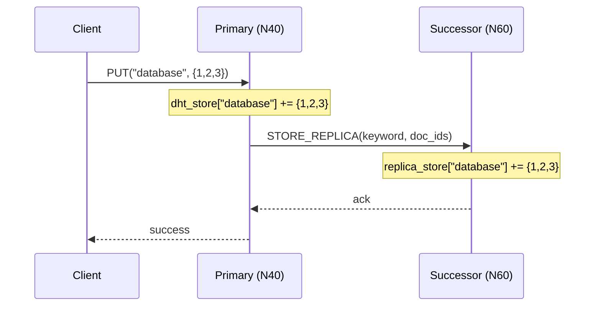
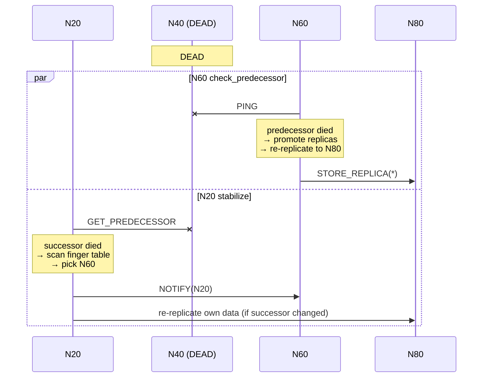

# Core System: Churn Resilience

Tài liệu này mô tả cách hệ thống P2P Library Search xử lý **churn** — sự kiện node rời mạng (chủ động leave hoặc đột tử). Mục tiêu là đảm bảo: (1) routing tiếp tục hoạt động, (2) dữ liệu DHT không bị mất, (3) trạng thái mạng tự hội tụ trở lại mà không cần can thiệp thủ công.

Cơ chế tracing đường đi khi xảy ra recovery được trình bày tại [[tracing_algorithm]] (mục 6.2).

---

## 1. Mô hình replication

Mỗi node giữ **2 kho dữ liệu song song** (định nghĩa tại `src/chord/node.py` + `src/chord/storage_mixin.py`):

| Kho | Vai trò | Khi nào ghi |
| :--- | :--- | :--- |
| `dht_store` | **Primary** — keyword → set(doc_id) mà node chịu trách nhiệm chính | Khi `PUT(keyword)` rơi vào node theo quy tắc Chord |
| `replica_store` | **Backup** — mirror data của *predecessor* | Khi nhận message `STORE_REPLICA` từ predecessor |
| `content_store` / `replica_content_store` | Tương tự, nhưng cho document content | Khi `PUT_CONTENT` / `STORE_CONTENT_REPLICA` |

**Hệ số replica hiện tại: r = 1** (mỗi key có đúng 2 bản: 1 primary + 1 replica trên successor liền kề).

### Sơ đồ ghi dữ liệu



---

## 2. Phát hiện node chết

Hệ thống dựa trên 2 cơ chế chạy định kỳ trong `stabilize_all()` (`ring.py:41-57`):

### 2.1. `check_predecessor()` — phát hiện predecessor chết
- Ping predecessor.
- Nếu fail (`NODE_NOT_FOUND` hoặc `TIMEOUT`) → đặt `predecessor_id = None` và kích hoạt **promote** + **re-replicate** (xem mục 3).

### 2.2. `stabilize()` — phát hiện successor chết
- Gửi `GET_PREDECESSOR` tới successor.
- Nếu Response `success=False` → quét finger table tìm node sống đầu tiên làm successor mới, rồi gọi `_re_replicate()` (`routing_mixin.py:307-322`).

### 2.3. Recovery khi routing
- Trong `find_successor`, nếu `closest_preceding_node` chỉ tới một node không phản hồi, logic fallback sẽ thử finger kế tiếp và ghi nhận một hop `RECOVERY` vào trace (xem [[tracing_algorithm]]).

---

## 3. Luồng tự phục hồi sau khi node chết

Giả sử ring có `N20 → N40 → N60 → N80` và **N40 chết**.

### Bước 1: N60 phát hiện predecessor N40 chết
`check_predecessor()` ping N40 → fail.

### Bước 2: Promote replica thành primary
N60 đang giữ `replica_store` chứa data của N40. Khi N40 chết, theo Chord, N60 trở thành node chịu trách nhiệm cho dải key cũ của N40 → cần đưa data từ replica lên primary.

```python
# storage_mixin.py:101-127
def _promote_replicas(self):
    for keyword, doc_ids in self.replica_store.items():
        self.dht_store.setdefault(keyword, set()).update(doc_ids)
    for doc_id, content in self.replica_content_store.items():
        self.content_store[doc_id] = content
    self.replica_store.clear()
    self.replica_content_store.clear()
```

### Bước 3: Re-replicate sang successor mới
Sau khi promote, N60 cần đảm bảo data của mình lại có 1 bản backup → đẩy toàn bộ `dht_store` sang N80.

```python
# storage_mixin.py:129-152
def _re_replicate(self, target_successor_id: int):
    for keyword, doc_ids in self.dht_store.items():
        self.transport.send(target_successor_id,
            Message("STORE_REPLICA", my_id, {"keyword": keyword, "doc_ids": list(doc_ids)}))
    for doc_id, content in self.content_store.items():
        self.transport.send(target_successor_id,
            Message("STORE_CONTENT_REPLICA", my_id, {"doc_id": doc_id, "content": content}))
```

### Bước 4: N20 phát hiện successor N40 chết
`stabilize()` thấy N40 không phản hồi → quét finger table → set `successor_id = N60` → cũng gọi `_re_replicate(N60)` để đảm bảo replica của N20 nằm đúng vị trí mới.

### Sơ đồ tổng



---

## 4. ChurnSimulator — benchmark trước/sau

`src/churn_simulation.py` cung cấp công cụ đo tác động của một sự kiện churn:

```
Phase 1: BEFORE   → snapshot metrics + chạy test queries → before_results
Phase 2: REMOVE   → ring.remove_node(target)
Phase 3: STABILIZE → ring.stabilize_all(rounds=N)
Phase 4: AFTER    → snapshot metrics + chạy CÙNG test queries → after_results
Phase 5: COMPARE  → ChurnReport (delta messages, keys recovered, query match)
```

`ChurnReport` ghi nhận:
- `keys_on_removed_node`: số keyword node bị xóa đang giữ làm primary.
- `keys_recovered_from_replica`: số keyword vẫn tồn tại (ở primary mới hoặc replica) sau churn.
- `all_queries_match`: liệu mọi query AND có trả về **cùng tập doc_id** trước/sau churn không — đây là **proof of correctness** cho người chấm.
- `metrics_delta`: chênh lệch message count để đánh giá overhead của quá trình self-healing.

---

## 5. Trạng thái test coverage

| Hạng mục | Test hiện có | File | Đánh giá |
| :--- | :--- | :--- | :--- |
| Routing recovery (successor failover) | `test_node_leave_churn` | `tests/test_chord_ring.py:49` | ✅ Đủ |
| Data handoff khi join | `test_data_handoff_on_join` | `tests/test_chord_node.py:92` | ✅ Đủ (chiều ngược: join) |
| Replica được tạo khi PUT | `test_storage_put_and_get` | `tests/test_chord_node.py:107` | ✅ Đủ |
| Replication coverage metric | `test_replication_coverage` | `tests/test_metrics.py:236` | 🟡 Lỏng (chỉ check range [0,1]) |
| ChurnDelta serialize | `test_churn_delta_to_dict` | `tests/test_metrics.py:332` | 🟡 Chỉ test format |
| Visualizer vẽ churn | `test_draw_churn_*` | `tests/test_visualizer.py:194-218` | 🟡 Chỉ test output PNG |
| **`_promote_replicas` end-to-end** | — | — | ❌ Thiếu |
| **`_re_replicate` end-to-end** | — | — | ❌ Thiếu |
| **Query AND còn đúng sau churn** | — | — | ❌ Thiếu (logic có ở `ChurnSimulator` nhưng không được test) |
| **Crash đồng thời 2 node liền kề** | — | — | ❌ Thiếu (boundary của r=1) |

---

## 6. Hạn chế đã biết

1. **r = 1** — Nếu primary và successor cùng chết trước khi stabilize kịp chạy, data của primary mất vĩnh viễn. Chord chuẩn dùng **successor list** (r ≈ log N) để chịu được nhiều node chết đồng thời. Đây là điểm có thể nâng cấp nếu cần điểm "Excellent+" về robustness.
2. **Stabilize đồng bộ** — `ring.stabilize_all()` lặp qua mọi node tuần tự trong simulation, không phải gossip bất đồng bộ thật. Đủ cho demo nhưng đừng tuyên bố "fully async".
3. **`keys_recovered_from_replica` đếm lỏng** — chỉ kiểm tra keyword có tồn tại ở bất kỳ node nào (primary hoặc replica), không phân biệt nó đã được promote thành primary chưa. Nếu cần chặt hơn, đếm riêng `promoted_to_primary` và `still_only_replica`.
4. **Replica chỉ chiều primary → successor** — không có sync khi predecessor cập nhật. Một số race condition khi node join giữa lúc replica đang fly có thể tạo replica lệch ngắn hạn (tự sửa ở round stabilize tiếp theo).

---

## 7. Liên kết

- Cơ chế tracing và hop `RECOVERY`: [[tracing_algorithm]]
- Hệ thống event log dùng để quan sát churn từ dashboard: [[event_system]]
