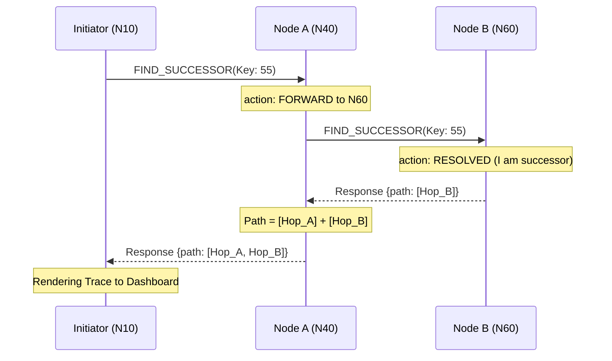
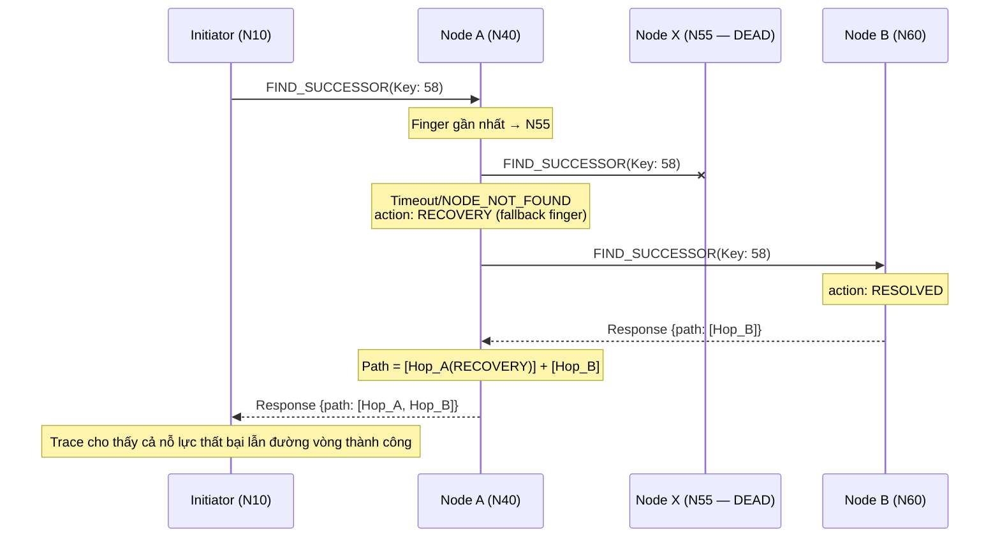

# Core Algorithm: Routing Tracing System

Tài liệu này mô tả chi tiết thuật toán và cơ chế ghi vết (Tracing) được cài đặt trong `RoutingMixin` của hệ thống P2P Library Search.

---

## 1. Tổng quan
Hệ thống sử dụng cơ chế **In-band Tracing (Source of Truth)**. Nghĩa là thông tin về đường đi của gói tin được ghi lại trực tiếp bởi các node thực hiện việc định tuyến và được chuyển về nút khởi tạo (Initiator) thông qua chính thông điệp phản hồi.

## 2. Mô hình Dữ liệu (Models)
Hệ thống sử dụng hai cấu trúc dữ liệu chính (định nghĩa tại `src/models/routing.py`):

1.  **RoutingHop**: Đại diện cho một chặng dừng chân tại một Node.
    - `node_id`: ID của node đang xử lý.
    - `action`: Hành động thực hiện (`FORWARD`, `RESOLVED`, `SELF`).
    - `next_node`: Node tiếp theo mà gói tin sẽ đi tới.
    - `reason`: Giải thích logic lựa chọn (ví dụ: "closest_preceding_node -> N15").

2.  **RoutingTrace**: Tập hợp các `RoutingHop` tạo thành một đường đi hoàn chỉnh.
    - `key`: ID của từ khóa đang tìm kiếm.
    - `target_id`: Node cuối cùng chịu trách nhiệm cho từ khóa.
    - `path`: Danh sách các `RoutingHop` theo thứ tự thời gian.

---

## 3. Thuật toán Tích lũy Dấu vết (Accumulation Algorithm)

Thuật toán hoạt động theo nguyên tắc **Đệ quy ngược (Reverse Accumulation)**:

### Bước 1: Khởi tạo chặng đi (Forwarding)
Khi Node A cần tìm kiếm Key $K$, nó xác định node tiếp theo là B:
- Ghi nhận hành động `FORWARD` tới B.
- Gửi yêu cầu `FIND_SUCCESSOR(K)` tới B.

### Bước 2: Xử lý tại nút Đích (Resolution)
Khi gói tin tới Node C (là node chịu trách nhiệm cho Key $K$):
- Node C tạo một `RoutingHop` với hành động `RESOLVED`.
- Node C đóng gói hop này vào danh sách `path` trong `Response` và gửi ngược lại cho node trước đó.

### Bước 3: Tích lũy dọc đường (Waiting & Accumulation)
Cơ chế này dựa trên mô hình **Blocking Call** (Lời gọi hàm chờ đợi):
- Khi Node B gửi yêu cầu cho Node C, Node B **tạm dừng** và đứng đợi Response từ C.
- Khi C trả về mảng `path` (chứa `[Hop_C]`), Node B "tỉnh dậy".
- Node B lấy danh sách này và thực hiện phép cộng mảng: `[Hop_B] + [Hop_C]`.
- Node B trả kết quả đã được "dán nhãn" này về cho Node A.

### Bước 4: Kết thúc tại Initiator
Quy trình lặp lại cho đến khi Initiator nhận được Response cuối cùng. Lúc này, mảng `path` đã chứa đầy đủ chữ ký của mọi node theo đúng thứ tự từ gần đến xa.

---

## 4. Dẫn chứng Code (Code Evidence)

Cơ chế "Gom dấu vết ở chiều về" được thể hiện rõ qua 2 vị trí trong `src/chord/routing_mixin.py`:

### 4.1. Tại các Node trung gian (Recursive Forwarding)
Khi một node nhận được yêu cầu và chuyển tiếp đi, nó sẽ đợi kết quả về và chèn chính mình vào đầu danh sách:

```python
# Trích từ hàm _handle_find_successor (Line 186-189)
if response.success:
    # Prepend hop của mình vào path downstream (dấu vết từ các node sau)
    downstream_path = response.data.get("path", [])
    response.data["path"] = [my_hop] + downstream_path
```

### 4.2. Tại Node khởi tạo (Initiator)
Node khởi tạo tạo ra `origin_hop` trước, sau đó cộng với toàn bộ danh sách `downstream_path` nhận được từ mạng:

```python
# Trích từ hàm find_successor_traced (Line 123-128)
return RoutingTrace(
    key=key_id,
    target_id=target_id,
    path=[origin_hop] + downstream_path, # Kết hợp hop đầu và chuỗi phía sau
    success=True
)
```

**Tại sao nó biết để thêm vào đầu?**
- Bởi vì lời gọi hàm là **Đệ quy (Recursive)** hoặc theo mô hình **Stack**. 
- Node A gọi B, B gọi C. Khi C trả về cho B, B vẫn đang "đứng đợi" ở dòng code tiếp theo. Ngay khi có kết quả từ C, B lấy "mảnh ghép" của C và dán mảnh của mình lên trước, rồi mới trả về cho A.

---

## 5. Các loại Hành động (Actions)

| Hành động | Ý nghĩa | Khi nào xảy ra? |
| :--- | :--- | :--- |
| **SELF** | Tự quản lý | Key nằm trong dải ID mà chính node đang giữ. |
| **RESOLVED** | Tìm thấy Đích | Node hiện tại xác định được Successor chính là node chứa key. |
| **FORWARD** | Chuyển tiếp | Node hiện tại tìm thấy một node khác trong Finger Table gần key hơn. |
| **RECOVERY** | Khôi phục | Xảy ra khi node định tới bị chết, node hiện tại thử một đường khác. |

---

## 6. Minh họa luồng ghi vết (Mermaid)

### 6.1. Happy path — không có node chết



### 6.2. Recovery path — node trung gian bị chết

Khi `closest_preceding_node` chỉ tới một node đã rời mạng, Transport trả về `NODE_NOT_FOUND` / `TIMEOUT`. Node hiện tại sẽ thử finger kế tiếp và ghi lại một hop `RECOVERY` để minh chứng đường vòng.



> Xem chi tiết cơ chế tự phục hồi tại [[churn_resilience]].

---

## 7. Ưu điểm của Thuật toán
1.  **Tính xác thực**: Mỗi node tự ghi lại lý do định tuyến của mình (ví dụ: dùng finger table thứ mấy).
2.  **Khả năng chịu lỗi**: Trace ghi lại cả những nỗ lực `RECOVERY` khi mạng có Churn, giúp người dùng thấy được cách hệ thống tự chữa lành.
3.  **Hiệu năng**: Trace được mang theo Response, không tạo ra thêm kết nối TCP/HTTP mới.

---

## 8. Ghi chú triển khai
Cần đảm bảo logic `_handle_find_successor` luôn thực hiện việc `prepend` (chèn lên đầu) để đảm bảo thứ tự các hop từ gần đến xa so với Initiator là chính xác.
