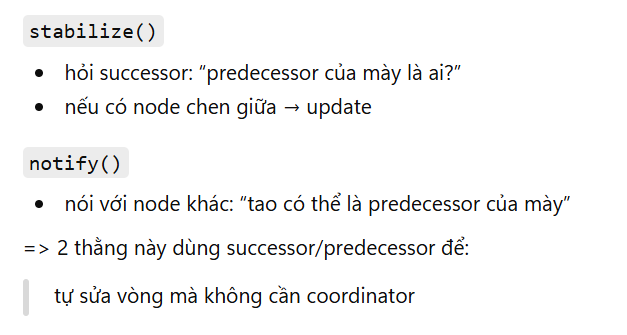
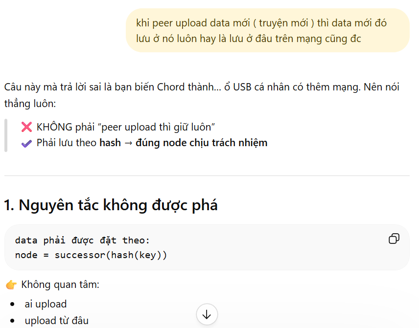

👉 Mọi design đều xoay quanh:
giảm số message
giảm kích thước message
giảm số hop

---
ko dùng flooding, chúng ta dùng DHT;
consitent hashing là nền tảng của DHT;
kiến trúc share-nothing;

# Chord:
    Mỗi node không chỉ biết hàng xóm
    → nó biết các node ở xa hơn theo cấp số nhân

    Công thức:
        finger[i]=successor(n+2^(i-1))
        - successor(x) = node đầu tiên theo chiều kim đồng hồ có ID ≥ x

# Chord là gì?

Chord = một thuật toán cụ thể để làm DHT

Nó trả lời mấy câu mà DHT bỏ trống:

Vấn đề | Chord trả lời
key đi đâu? | consistent hashing lên ring
node nào giữ key? | successor của key
tìm node kiểu gì? | finger table → O(log N)
node join? | update successor/predecessor
node chết? | stabilize + fix_fingers

# 1. Consistent Hashing (Cốt lõi)

Không gian ID là một vòng tròn (ring) từ 0 đến 2^m - 1.

- **Mỗi node** được gán một ID duy nhất trên vòng tròn này.
- **Mỗi key** (từ dữ liệu) cũng được băm ra một ID trên vòng tròn.
- **Quy tắc:** Một key thuộc về node **successor** của nó (node đầu tiên theo chiều kim đồng hồ có ID ≥ key ID).

# 2. Finger Table (Bảng ngón tay)

Để tìm key trong O(log N) thay vì O(N) (duyệt tuần tự), mỗi node giữ một **finger table**.

- Finger[i] trỏ đến node tiếp theo có ID ≥ (n + 2^(i-1)) mod 2^m.
- Với m = 32, mỗi node chỉ cần lưu 32 con trỏ.

# 3. Tìm kiếm (Lookup)

Để tìm node giữ key `k`:

1. Bắt đầu từ node hiện tại `n`.
2. Kiểm tra xem `k` có nằm giữa `n` và `finger[1]` không.
3. Nếu có → chuyển sang `finger[1]`.
4. Nếu không → chuyển sang `finger[i]` lớn nhất mà `finger[i]` vẫn < `k`.
5. Lặp lại cho đến khi tìm thấy.

Độ phức tạp: O(log N).

# 4. Node Join

Khi node mới `n` gia nhập:

1. Tìm vị trí của `n` trên ring (hỏi successor của node bất kỳ).
2. Khởi tạo finger table của `n` (hỏi successor của các mốc 2^i).
3. Thông báo cho các node khác cập nhật finger table của chúng.
4. Di chuyển dữ liệu cần thiết từ successor sang `n`.

# 5. Node Leave / Fail

Khi node rời đi:

1. Thông báo cho successor để nó cập nhật successor pointer.
2. Di chuyển dữ liệu của node rời sang successor.
3. Các node khác cập nhật bằng việc gọi hàm lookup để cập nhật finger table khi tìm kiếm.

# 6. Stabilize (Ổn định)

Để đảm bảo tính đúng đắn khi node join/leave, mỗi node định kỳ chạy `stabilize()`:

1. Hỏi successor của nó: "Ai là predecessor của bạn?"
2. Nếu predecessor đó nằm giữa `n` và `successor`, cập nhật `finger[1]` của `n`.
3. Thông báo cho successor: "Tôi là predecessor của bạn".

# 7. Ý nghĩa của Successor và Predecessor

- **Successor** của một node `n` là node đầu tiên theo chiều kim đồng hồ có ID ≥ `n`.
- **Predecessor** của một node `n` là node đầu tiên ngược chiều kim đồng hồ có ID ≤ `n`.

- successor: đảm bảo reachability
- predecessor: đảm bảo correctness boundary

# 9. Handoff data

- khi data join, node join vào giữa 2 node, node join phải nhận data từ successor của nó
- khi data leave, node leave phải chuyển data cho successor của nó

# Kiến trúc lưu trữ dữ liệu trong DHT P2P Search ở mỗi peer 

1. Nhóm Dữ liệu Nội dung Phân tán (Storage State)
Đây là "bộ nhớ kho" của Node, được quản trị hoàn toàn bởi thuật toán DHT (chỉ lưu những data mà hàm Băm chỉ định nó phải lưu):

dht_store (DHT Primary Index)
Kiểu dữ liệu: Dict[str, Set[int]] (Ví dụ: {"database": [1, 2, 3]})
Lưu gì: Mảng tìm kiếm ngược (Inverted Index). Nó chứa các Keyword cùng danh sách các mã định danh của tài liệu DocID.
content_store (Tài liệu gốc)
Kiểu dữ liệu: Dict[int, dict] (Ví dụ: {1: {"title": "Brave New", "content": "..."}})
Lưu gì: Bản chứa Full JSON văn bản của toàn bộ tác phẩm truyện. Khi User click vào list truyện mảng ở trên, client sẽ query thẳng vào store này thông qua DocID để mở truyện đọc.
replica_store và replica_content_store (Kho dự phòng)
Lưu gì: Tương tự y như 2 Store trên, nhưng đây là "Bản Rương Dự Phòng". Trong P2P, để chống sập mạng, một Node luôn nhận lệnh lưu giùm toàn bộ rương chứa Index và rương chứa Truyện của node Đứng Trước Nó (Predecessor). Khi thằng đứng trước không may bị mất điện đứt mạng, Node này sẽ tự đứng lên đắp rương dự phòng vào rương chính để thay thế.
(Lưu ý: local_index hiện tại đã hoàn toàn rỗng và không cần sử dụng tới nữa do kiến trúc hiện tại sẽ băm thẳng vào 2 store chính ở trên).

2. Nhóm Dữ liệu Định tuyến mạng (Routing State)
Đây là mảng chứa "la bàn" chỉ đường, giúp Node biết mình nằm ở tọa độ nào trên Vòng tròn Chord và hàng xóm mình là ai:

node_id: Định danh băm tuyệt đối trên hệ thống (Ví dụ: N110, N210,...).
successor_id: Node nối tiếp theo chiều kim đồng hồ trên vòng (Hàng xóm bên phải).
predecessor_id: Node nối tiếp ngược chiều kim đồng hồ (Hàng xóm bên trái).
finger_table:
Kiểu dữ liệu: Danh sách (List) các bước nhảy vọt (Shortcuts).
Lưu gì: Bản đồ lối tắt giúp Node đi xuyên qua vòng nhẫn mà không cần hỏi từng người một. Đây chính là thuật toán lõi giúp DHT Chord lấy được Data với tốc độ cực nhanh $O(\log N)$ thay vì quét ngang toàn tuyến là $O(N)$.
3. Nhóm Giao tiếp & Thu thập Trình trạng (Transport & Trace)
registry: Danh bạ IP / Port của mạng để biết cách gọi giao thức HTTP cho người khác.
message_log: Lưu trữ toàn bộ lịch sử gói tin (Traffic) truyền đi, truyền đến phục vụ cho UI vẽ đường đi theo dõi vết (Tracing overlay trên Dashboard).
Đó là một bức tranh toàn cảnh về cách 1 Peer trong hệ thống đang "sống" và nắm giữ thông tin gì. Bạn đã nắm rõ chưa, chúng ta có thể ấn chấp nhận ở bảng Kế hoạch tab bên cạnh để tôi gỡ nốt local_index cũ đi cho trống trải nhé?

# Nguyên tắc upload data

2. Flow đúng khi upload story

Giả sử peer A upload:

doc_id = 42
Step 1 – hash
K = hash(42)
Step 2 – tìm node
owner = find_successor(K)
Step 3 – gửi data
A → gửi content → owner
Step 4 – replicate
owner → gửi replica → successor+1, successor+2

👉 Kết quả:

data KHÔNG nằm ở A (trừ khi A trùng owner)

Tại sao không lưu tại peer upload?

Nghe tiện, nhưng sai về bản chất:

❌ 3.1. Mất load balancing
peer upload nhiều → giữ nhiều data
peer khác rảnh

→ hệ thống lệch

❌ 3.2. Routing mất ý nghĩa

Chord sinh ra để:

→ biết node nào giữ key

Nếu bạn ignore:

→ DHT = vô dụng

❌ 3.3. Peer chết → mất hết data của nó

Bạn vừa tạo:

single point of failure

---

1. Chiến Lược Xử Lý Churn Toàn Diện (Cốt lõi Hệ Thống)
Việc Node rời mạng (chết/rút phích cắm) trong P2P cần một chiến lược khép kín bao gồm: Phát hiện, Phục hồi Topology, và Phục hồi Dữ liệu. Dưới đây là chiến lược cốt lõi:

A. Cơ chế Phát hiện (Tại sao lại dùng Ping?)
Lý thuyết chuẩn: Trong môi trường Phân tán, các Node thường chết trong im lặng (mất điện, đứt cáp). Bất kể dùng giao thức nào (HTTP, gRPC, hay TCP Socket), cách duy nhất và là "Tiêu chuẩn Công nghiệp" để phát hiện cái chết im lặng là dùng nhịp tim định kỳ (Heartbeat / Ping).
Hiện trạng Code: Logic này ĐÃ CÓ SẴN trong code hiện tại. Dashboard liên tục gọi /api/stabilize, từ đó kích hoạt check_predecessor() (để ping Predecessor) và stabilize() (để ping Successor).
B. Chiến lược Xử lý khi Predecessor chết
Hành động 1 (Data Promotion): Khi check_predecessor() ping hụt, Node hiện tại biết Chủ nhân vùng Hash trước đó đã chết. Node sẽ gọi _promote_replicas() để đưa toàn bộ dữ liệu Backup lên làm dữ liệu Chính (dht_store và content_store). Giải quyết triệt để lỗi "No matching documents".
Hành động 2 (Tái dự phòng - Re-replication): Sau khi thăng cấp dữ liệu lên làm bản Chính, bản thân khối dữ liệu đó lại rơi vào trạng thái nguy hiểm (không có Backup). Do đó, Node hiện tại phải lập tức đóng gói khối dữ liệu vừa thăng cấp này và gửi STORE_REPLICA sang cho Successor của mình.
Hành động 3 (Sửa vòng Ring): Node KHÔNG chủ động đi tìm Predecessor mới (chỉ đơn giản gán predecessor = None). Theo chuẩn Chord, việc sửa vòng Ring là trách nhiệm của Node đứng phía sau kẻ vừa chết. Node đứng sau đó sẽ nhận ra Successor của nó đã chết, và tự động tìm đến Node hiện tại để nối lại vòng Ring.
C. Chiến lược Xử lý khi Successor chết
Hành động 1 (Sửa vòng Ring chủ động): Khi stabilize() thấy Successor chết, nó BẮT BUỘC phải chủ động sửa vòng Ring bằng cách dò trong Finger Table tìm Node sống gần nhất để gán làm Successor mới.
Hành động 2 (Tái dự phòng - Re-replication): Tương tự như trên, sau khi nối được với Successor mới, Node hiện tại phải gửi toàn bộ bản Chính (dht_store) của nó sang Successor mới để làm Backup. Đảm bảo dữ liệu không bao giờ bị mất nếu xảy ra Churn liên tiếp.
Kích hoạt: Bổ sung logic Re-replication vào stabilize() và check_predecessor() trong routing_mixin.py và storage_mixin.py.

---

Kịch bản Demo cho Thầy (Dynamic Join):
Bước 1: Chạy một Node mới thủ công Khi thầy bảo: "Bây giờ tôi muốn thêm 1 Node nữa vào mạng thì làm thế nào?", bạn hãy mở một Terminal mới (ngoài 6 cái đang có) và gõ lệnh:

powershell
uv run peer_server.py --node-id 135 --port 8006 --m 8
(Lúc này Node 135 đã chạy nhưng nó đứng một mình, chưa ai biết đến nó).

Bước 2: Đăng ký Node vào Dashboard Trên giao diện Web, bạn sẽ thấy tôi vừa thêm phần "Professor Demo: Dynamic Join".

Ô Node ID: Nhập 135.
Ô Port: Nhập :8006.
Bấm Add Peer to Dashboard. (Lúc này thẻ Node 135 sẽ hiện ra trên giao diện nhưng trạng thái là chưa Join Ring).
Bước 3: Thực hiện Join

Trên thẻ của Node 135 vừa hiện ra, bạn nhấn nút Join.
Nhập một Node ID đang có sẵn (ví dụ: 10) để nó làm "người dẫn đường".
Nhấn OK.